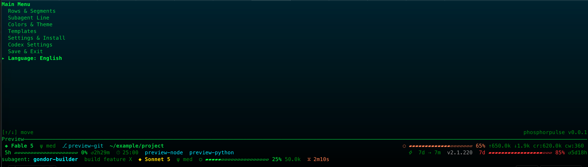

# phosphorpulse

[English](./README.md) | [繁體中文](./README.zh-TW.md)

[](https://github.com/twjohnwu/phosphorpulse/actions)
[](LICENSE)



A fast Rust statusline renderer for Claude Code: a byte-parity rewrite of the TypeScript project phosphorflux, with a full-screen terminal TUI built with ratatui. Its warm render median is 6.8 ms versus 247.8 ms for the TypeScript version on the same Intel machine (~36x), and 8.4 ms versus 478.5 ms on an M2 (~57x).

| Implementation | Intel median | Intel p10–p90 | CPU @1s (Intel) | M2 median | M2 p10–p90 | CPU @1s (M2) | Speedup vs TS (Intel / M2) |
|---|---:|---:|---:|---:|---:|---:|---:|
| TypeScript (phosphorflux) | 247.8 ms | 241.0–253.2 ms | ~24.8% | 478.5 ms | 374.5–510.3 ms | ~47.8% | 1x |
| Bash (coralline) | 43.4 ms | 42.5–44.3 ms | ~4.3% | 44.6 ms | 43.5–47.1 ms | ~4.5% | ~5.7x / ~10.7x |
| Rust (phosphorpulse) | **6.8 ms** | 6.4–7.7 ms | **~0.7%** | **8.4 ms** | 7.7–8.9 ms | **~0.8%** | **~36x / ~57x** |

Single render including process startup. Both machines: median of 30 timed runs after 5 warmups; on each machine all three implementations were fed the same input JSON (Intel measured 2026-08-16). The two machines used different environments and input JSON, so absolute values are not comparable across machines — compare the ratios instead. All Bash rows run the same coralline statusline.sh. Local measurements, not a committed benchmark.

## Install

Download a prebuilt binary from GitHub Releases, or build from source with Rust.
Put the `phosphorpulse` binary on your `PATH`.
See the [step-by-step installation guide](docs/install.md).

## Quick start

Add these statusline entries to `~/.claude/settings.json`:

```json
{
  "statusLine": {
    "type": "command",
    "command": "phosphorpulse render"
  },
  "subagentStatusLine": {
    "type": "command",
    "command": "phosphorpulse render --subagent"
  }
}
```

The TUI's **Settings & Install** screen, or the first-run setup wizard, can add these entries automatically. It shows a diff, asks for confirmation, and backs up the existing `settings.json` before writing.

## CLI reference

| Command | Description |
| --- | --- |
| `phosphorpulse render` | Reads Claude Code statusline JSON from stdin and prints the rendered statusline. |
| `phosphorpulse render --subagent` | Does the same for the subagent statusline. |
| `phosphorpulse config` | Prints the active configuration and its sources. |
| `phosphorpulse migrate` | Copies configuration from phosphorflux. |
| `phosphorpulse migrate --force` | Copies configuration from phosphorflux, forcing the migration. |
| `phosphorpulse` | In a TTY, launches the full-screen TUI; on a first run with no existing configuration, it launches the setup wizard. In a non-TTY context, prints a help line and exits with status 1. |

## Configuration

The configuration directory is `$PPULSE_CONFIG_DIR` when set; otherwise it is `~/.claude/phosphorpulse/`, containing `settings.json` and a `templates/` directory.

Required configuration keys are `style`, `activeTemplate`, `colorDepth`, `rows`, `subagent`, and `gauge`. Optional keys are `pomodoro` and `segments`.

## Built-in themes

The built-in themes are `matrix-tron` (the default, green/cyan), `solarized-dark`, and `solarized-light`. See [themes and templates documentation](docs/themes.md) for the full details.

phosphorpulse also provides a Codex statusline integration through its TUI, including `config.toml` and TextMate theme editing. See [Codex integration details](docs/themes.md#codex).

## Migrating from phosphorflux

Run `phosphorpulse migrate` to copy configuration from phosphorflux. Use `phosphorpulse migrate --force` to force the migration.

MIT License © 2026 [twjohnwu](https://github.com/twjohnwu). See [LICENSE](LICENSE).
