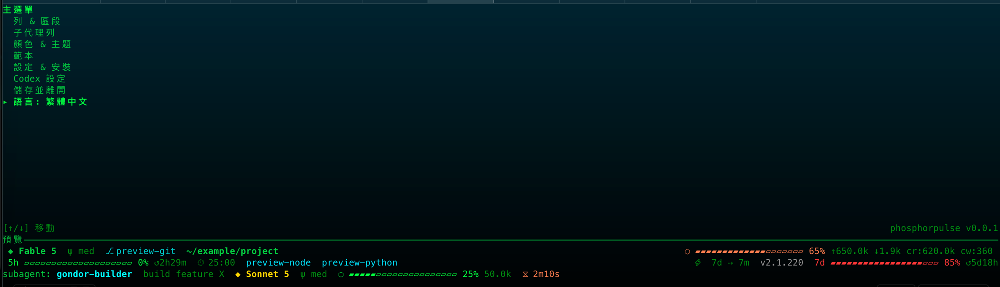

# phosphorpulse

[English](./README.md) | [繁體中文](./README.zh-TW.md)

[](https://github.com/twjohnwu/phosphorpulse/actions)
[](LICENSE)



適用於 Claude Code 的快速 Rust statusline renderer：TypeScript 專案 phosphorflux 的 byte-parity rewrite，並內建以 ratatui 建置的全螢幕 terminal TUI。同一台 Intel 機上 warm render median 為 6.8 ms，TypeScript version 為 247.8 ms（約快 36x）；M2 上為 8.4 ms 對 478.5 ms（約快 57x）。

| Implementation | Intel median | Intel p10–p90 | CPU @1s (Intel) | M2 median | M2 p10–p90 | CPU @1s (M2) | Speedup vs TS (Intel / M2) |
|---|---:|---:|---:|---:|---:|---:|---:|
| TypeScript (phosphorflux) | 247.8 ms | 241.0–253.2 ms | ~24.8% | 478.5 ms | 374.5–510.3 ms | ~47.8% | 1x |
| Bash (coralline) | 43.4 ms | 42.5–44.3 ms | ~4.3% | 44.6 ms | 43.5–47.1 ms | ~4.5% | ~5.7x / ~10.7x |
| Rust (phosphorpulse) | **6.8 ms** | 6.4–7.7 ms | **~0.7%** | **8.4 ms** | 7.7–8.9 ms | **~0.8%** | **~36x / ~57x** |

單次 render 含 process startup。兩機皆為 warmup 5 次後計時 30 次的 median；同一台機器上三個實作餵相同輸入 JSON（於 2026-08-16 量測）。兩機環境與輸入 JSON 不同，絕對值不可跨機比較——倍率才可比。Bash 兩機跑的是同一支 coralline statusline.sh。皆為 local measurements，非 committed benchmark。

## 安裝

可從 GitHub Releases 下載 prebuilt binary，或使用 Rust 從 source build。
請將 `phosphorpulse` binary 放到 `PATH` 上。
請參閱[逐步安裝指南](docs/install.zh-TW.md)。

## 快速開始

在 `~/.claude/settings.json` 加入下列 statusline entries：

```json
{
  "statusLine": {
    "type": "command",
    "command": "phosphorpulse render",
    "refreshInterval": 1
  },
  "subagentStatusLine": {
    "type": "command",
    "command": "phosphorpulse render --subagent"
  }
}
```

`refreshInterval: 1` 讓時間型 segments（pomodoro、時鐘、重置倒數）每秒跳動；單次 render 約占單核 0.7%。

TUI 的 **Settings & Install** 畫面或首次執行的 setup wizard 可自動加入這些 entries。寫入前會顯示 diff、要求確認，並備份既有的 `settings.json`。

## CLI 參考

| Command | 說明 |
| --- | --- |
| `phosphorpulse render` | 從 stdin 讀取 Claude Code statusline JSON，並輸出 rendered statusline。 |
| `phosphorpulse render --subagent` | 為 subagent statusline 執行相同操作。 |
| `phosphorpulse config` | 輸出 active configuration 及其 sources。 |
| `phosphorpulse migrate` | 從 phosphorflux 複製 configuration。 |
| `phosphorpulse migrate --force` | 從 phosphorflux 複製 configuration，並強制執行 migration。 |
| `phosphorpulse` | 在 TTY 中啟動全螢幕 TUI；首次執行且沒有既有 configuration 時，會啟動 setup wizard。在 non-TTY context 中，會印出 help line 並以 status 1 結束。 |

## Configuration

若已設定 `$PPULSE_CONFIG_DIR`，configuration directory 即為該值；否則為 `~/.claude/phosphorpulse/`，其中包含 `settings.json` 與 `templates/` directory。

必要的 configuration keys 為 `style`、`activeTemplate`、`colorDepth`、`rows`、`subagent` 與 `gauge`。選用 keys 為 `pomodoro` 與 `segments`。

## 內建 themes

內建 themes 為 `matrix-tron`（預設，green/cyan）、`solarized-dark` 與 `solarized-light`。完整細節請見 [themes and templates documentation](docs/themes.zh-TW.md)。

phosphorpulse 也透過 TUI 提供 Codex statusline integration，包括 `config.toml` 與 TextMate theme editing。詳情請見 [Codex integration details](docs/themes.zh-TW.md#codex)。

## 從 phosphorflux 遷移

執行 `phosphorpulse migrate` 以從 phosphorflux 複製 configuration。使用 `phosphorpulse migrate --force` 可強制執行 migration。

MIT License © 2026 [twjohnwu](https://github.com/twjohnwu). See [LICENSE](LICENSE).
