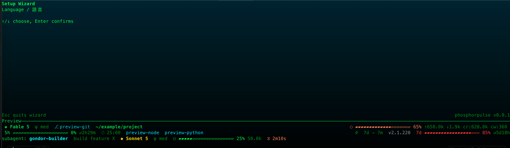
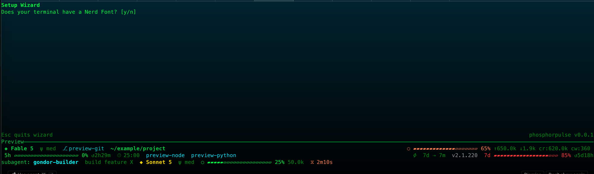
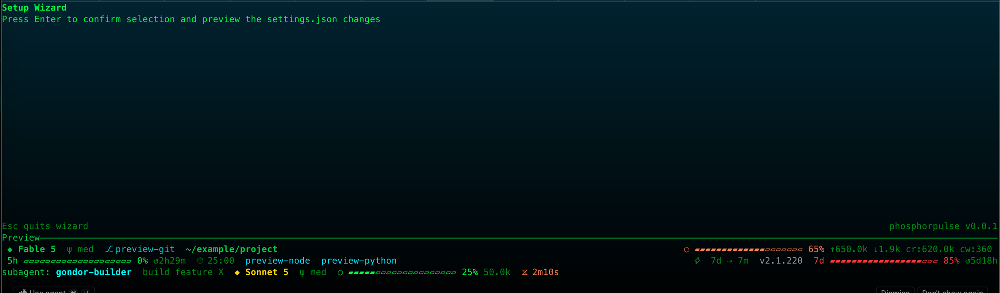
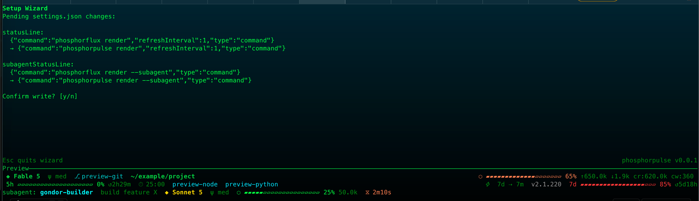

Read this in: [繁體中文](install.zh-TW.md)

# Installation

## 1. Route A — Prebuilt binary (no Rust required)

1. Open the [GitHub Releases](https://github.com/twjohnwu/phosphorpulse/releases) page and download the archive for your platform:
   - `x86_64-apple-darwin` for Intel macOS
   - `aarch64-apple-darwin` for Apple Silicon macOS
   - `x86_64-unknown-linux-gnu` for 64-bit Linux
   - `x86_64-pc-windows-msvc` for 64-bit Windows

   The release workflow uses cargo-dist for these targets and SHA-256 checksums. Its default archive formats are `.tar.xz` on Unix and `.zip` on Windows; select the asset with the matching target instead of relying on a guessed filename.

2. Download the checksum manifest from the same release and verify the archive before extracting it. Replace `<checksum-file>` with the checksum asset's actual name:

   ```sh
   shasum -a 256 -c <checksum-file>
   ```

3. Extract the archive. On Unix, for example:

   ```sh
   tar -xf <archive>.tar.xz
   ```

   On Windows, extract the `.zip` archive with File Explorer or a zip tool.

4. On macOS, remove the downloaded-file quarantine attribute, then make the binary executable:

   ```sh
   xattr -d com.apple.quarantine phosphorpulse
   chmod +x phosphorpulse
   ```

5. Put the binary on your `PATH`:

   ```sh
   mkdir -p ~/.local/bin
   mv phosphorpulse ~/.local/bin/
   export PATH="$HOME/.local/bin:$PATH"
   command -v phosphorpulse
   ```

   Add the `export PATH="$HOME/.local/bin:$PATH"` line to `~/.zshrc` or `~/.bashrc` to keep it for future shells. On Windows, add the folder that contains `phosphorpulse.exe` to your user `PATH`, then open a new terminal.

## 2. Route B — Build from source

1. Install Rust with rustup, using its official installer command:

   ```sh
   curl --proto '=https' --tlsv1.2 -sSf https://sh.rustup.rs | sh
   ```

2. From the repository root, build the release binary:

   ```sh
   cargo build --release
   ```

3. Install it into your local bin directory:

   ```sh
   mkdir -p ~/.local/bin
   cp target/release/phosphorpulse ~/.local/bin/
   ```

   If necessary, use the `PATH` step in Route A before continuing.

## 3. Wire it into Claude Code

Choose either the wizard or a manual edit.

### Wizard

1. Run `phosphorpulse` from a terminal with a TTY. The wizard opens when phosphorpulse's own config is missing, or when Claude's statusLine command does not contain `phosphorpulse`; otherwise the main menu opens.
2. Complete the screens in this order: language, Nerd Font (`y` or `n`), binary detection, template selection, then settings confirmation.

   

   

   
3. Binary detection checks `PATH` and `~/.local/bin`. If the binary is missing, press `b` to let the wizard copy the currently running binary into `~/.local/bin` (confirm with `y`), or install it with Route A or Route B and press any key to detect it again — both options also work from the not-found screen after a failed re-scan.
4. After choosing a template, confirm the settings write with `y` (or Enter). This writes the Claude Code blocks to `~/.claude/settings.json`; when that file already exists, it first creates a `settings.json.bak-<timestamp>` backup. The wizard then writes phosphorpulse's own configuration.

   

   After the template step, the wizard shows the pending `settings.json` changes (current block -> proposed block for `statusLine` and `subagentStatusLine`) before the `y`/`n` confirmation — the same diff the **Settings & Install** screen displays.

### Manual settings.json edit

Add these two blocks to `~/.claude/settings.json` (while preserving any other settings you use):

```json
{
  "statusLine": {
    "type": "command",
    "command": "phosphorpulse render"
  },
  "subagentStatusLine": {
    "type": "command",
    "command": "phosphorpulse render --subagent"
  }
}
```

## 4. Migrate from phosphorflux

Run:

```sh
phosphorpulse migrate
```

This copies `settings.json` and pomodoro state from the phosphorflux configuration directory. Existing destination files are skipped; use `--force` to overwrite them:

```sh
phosphorpulse migrate --force
```

## 5. Verify

Run the following command to print the active configuration and its sources:

```sh
phosphorpulse config
```

Start Claude Code and confirm that its statusline appears.

## 6. Uninstall

Remove the binary from the directory where you installed it, then remove the default phosphorpulse configuration directory:

```sh
rm ~/.local/bin/phosphorpulse
rm -rf ~/.claude/phosphorpulse/
```
