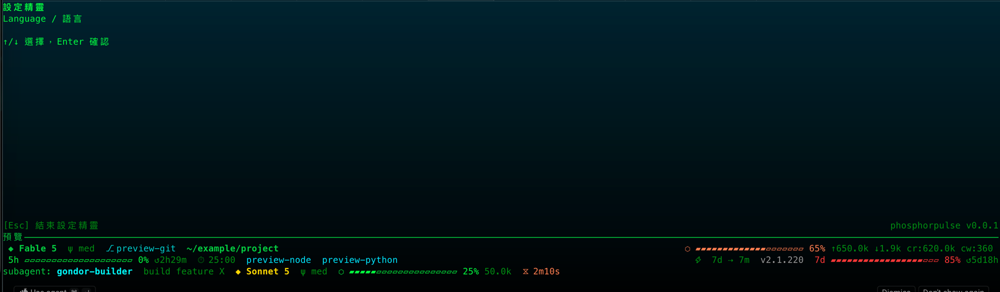
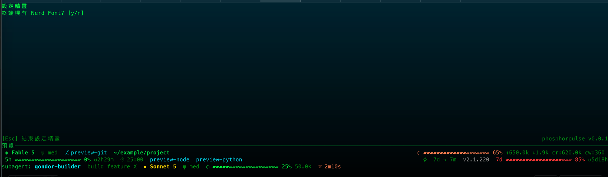
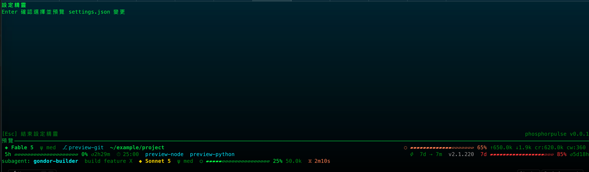
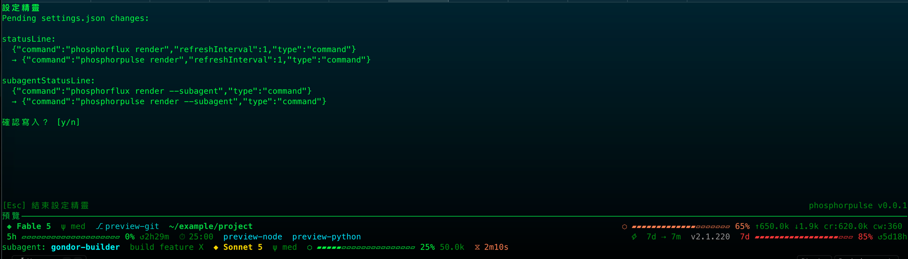

Read this in: [English](install.md)

# 安裝

## 1. Route A — Prebuilt binary（不需要 Rust）

1. 開啟 [GitHub Releases](https://github.com/twjohnwu/phosphorpulse/releases) 頁面，並下載對應平台的 archive：
   - Intel macOS 使用 `x86_64-apple-darwin`
   - Apple Silicon macOS 使用 `aarch64-apple-darwin`
   - 64-bit Linux 使用 `x86_64-unknown-linux-gnu`
   - 64-bit Windows 使用 `x86_64-pc-windows-msvc`

   Release workflow 對這些 targets 使用 cargo-dist 與 SHA-256 checksums。其預設 archive formats 為 Unix 的 `.tar.xz` 與 Windows 的 `.zip`；請選擇 target 相符的 asset，而不要依賴猜測的 filename。

2. 從同一個 release 下載 checksum manifest，並在 extraction 前驗證 archive。請將 `<checksum-file>` 替換成 checksum asset 的實際名稱：

   ```sh
   shasum -a 256 -c <checksum-file>
   ```

3. Extract archive。在 Unix，例如：

   ```sh
   tar -xf <archive>.tar.xz
   ```

   在 Windows，使用 File Explorer 或 zip tool extract `.zip` archive。

4. 在 macOS，移除 downloaded-file quarantine attribute，然後讓 binary 可執行：

   ```sh
   xattr -d com.apple.quarantine phosphorpulse
   chmod +x phosphorpulse
   ```

5. 將 binary 放到 `PATH`：

   ```sh
   mkdir -p ~/.local/bin
   mv phosphorpulse ~/.local/bin/
   export PATH="$HOME/.local/bin:$PATH"
   command -v phosphorpulse
   ```

   將 `export PATH="$HOME/.local/bin:$PATH"` 加到 `~/.zshrc` 或 `~/.bashrc`，使之在後續 shells 中持續生效。在 Windows，將包含 `phosphorpulse.exe` 的 folder 加到使用者 `PATH`，然後開啟新的 terminal。

## 2. Route B — 從 source build

1. 使用 rustup 的官方 installer command 安裝 Rust：

   ```sh
   curl --proto '=https' --tlsv1.2 -sSf https://sh.rustup.rs | sh
   ```

2. 在 repository root build release binary：

   ```sh
   cargo build --release
   ```

3. 將它安裝到 local bin directory：

   ```sh
   mkdir -p ~/.local/bin
   cp target/release/phosphorpulse ~/.local/bin/
   ```

   如有需要，請在繼續前使用 Route A 的 `PATH` step。

## 3. 將它連接至 Claude Code

選擇 wizard 或 manual edit 其中一種方式。

### Wizard

1. 從具備 TTY 的 terminal 執行 `phosphorpulse`。當 phosphorpulse 的 own config 不存在，或 Claude 的 statusLine command 未包含 `phosphorpulse` 時會開啟 wizard；否則進入主選單。
2. 依照此順序完成畫面：language、Nerd Font（`y` 或 `n`）、binary detection、template selection，然後是 settings confirmation。

   

   

   
3. Binary detection 只檢查 `phosphorpulse` 是否已在 `PATH` 上；它絕不會安裝 binary。若找不到，請依 Route A 或 Route B 安裝，然後按任意鍵重新偵測。
4. 選擇 template 後，以 `y`（或 Enter）確認 settings write。這會將 Claude Code blocks 寫入 `~/.claude/settings.json`；若該檔案已存在，會先建立 `settings.json.bak-<timestamp>` backup。接著 wizard 會寫入 phosphorpulse 自己的 configuration。

   

   Template 步驟之後，wizard 會在 `y`/`n` confirmation 前顯示 `settings.json` 的 pending changes（`statusLine` 與 `subagentStatusLine` 的 current -> proposed 區塊）——與 **Settings & Install** 畫面顯示的是同一份 diff。

### Manual settings.json edit

在 `~/.claude/settings.json` 加入這兩個 blocks（同時保留您使用的其他 settings）：

```json
{
  "statusLine": {
    "type": "command",
    "command": "phosphorpulse render"
  },
  "subagentStatusLine": {
    "type": "command",
    "command": "phosphorpulse render --subagent"
  }
}
```

## 4. 從 phosphorflux 遷移

執行：

```sh
phosphorpulse migrate
```

這會從 phosphorflux configuration directory 複製 `settings.json` 與 pomodoro state。既有的 destination files 會被略過；請使用 `--force` 覆寫：

```sh
phosphorpulse migrate --force
```

## 5. 驗證

執行下列 command，印出 active configuration 與其 sources：

```sh
phosphorpulse config
```

啟動 Claude Code 並確認其 statusline 出現。

## 6. Uninstall

從安裝 binary 的 directory 移除 binary，然後移除預設的 phosphorpulse configuration directory：

```sh
rm ~/.local/bin/phosphorpulse
rm -rf ~/.claude/phosphorpulse/
```
