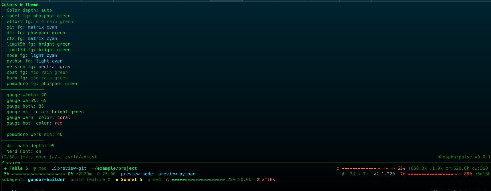
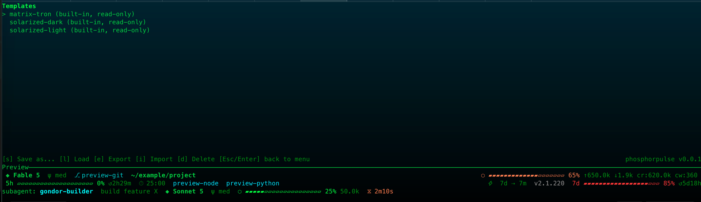

Read this in: [繁體中文](themes.zh-TW.md)

# Themes and templates

phosphorpulse includes three built-in themes:

- `matrix-tron` is the default theme, using green and cyan.
- `solarized-dark` is the dark Solarized theme.
- `solarized-light` is the light Solarized theme.

The TUI's Templates feature supports save-as, load, export, and import. Import validates a template file and saves it only in the `templates/` directory; it does not change the current working draft, so load the imported template afterward to apply it. When loading a template, its rows, subagent, gauge, segments, and name are applied, but a custom color palette is not applied. This matches a limitation in the original TypeScript phosphorflux project.

## Codex

The TUI's **Codex Settings** screen edits the `[tui]` table in `~/.codex/config.toml`. It manages `status_line`, `status_line_use_colors`, and `theme`.

`status_line` is an ordered list of up to these eight known IDs:

- `model-with-reasoning`
- `current-dir`
- `git-branch`
- `run-state`
- `codex-version`
- `context-used`
- `five-hour-limit`
- `weekly-limit`

Unknown IDs already in `status_line` are preserved untouched. `status_line_use_colors` is a boolean. `theme` is the file stem of a TextMate `.tmTheme` file.

The TUI also provides a `.tmTheme` color editor for the theme's global foreground and background, plus the four Codex-specific scopes `constant.numeric`, `constant`, `constant.language`, and `storage.type`. Its split operation turns one fused selector entry that covers several of those scopes into four dedicated entries. Each new entry starts with the color that scope currently resolves to, so splitting alone does not visibly change rendering; edit the entries individually afterward to change their colors.

While editing, the TUI shows a single-row live preview of the Codex statusline. When `status_line_use_colors` is off, this preview is uncolored. Codex renders these scope colors statically: they change when the theme file is edited, never dynamically at runtime.

**Transparent background?** Codex does not treat tmTheme alpha as opacity (it is only syntect's reserved encoding), and it has no `transparent_background` option; the feature request remains open at [openai/codex#14661](https://github.com/openai/codex/issues/14661). In practice, set the theme background to your terminal's own background color.

Writes to both `config.toml` and `.tmTheme` files are atomic and use a stale-file check. If a file changed on disk after the TUI last read it, the write is aborted.
