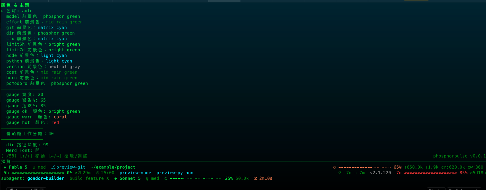
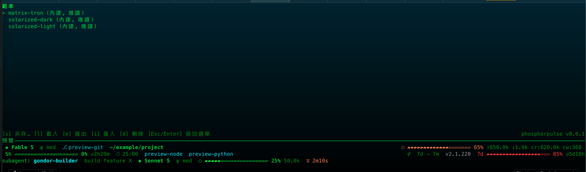

Read this in: [English](themes.md)

# Themes and templates

phosphorpulse 內建三種 themes：

- `matrix-tron` 是預設 theme，使用 green 與 cyan。
- `solarized-dark` 是深色版的 Solarized theme。
- `solarized-light` 是淺色版的 Solarized theme。

TUI 的 Templates 功能支援 save-as、load、export、import 與 delete（`d`；僅限已儲存的 templates——內建 templates 不可刪除）。Export 預設寫到 `~/Desktop/<name>.json`，確認前可修改路徑。Import 會驗證 template file 並只將它存到 `templates/` directory；不會改變目前的 working draft，因此匯入後仍須 load 該 template 才會套用。Load template 時，會套用其 rows、subagent、gauge、segments 與 name，但不會套用自訂的 color palette。這與原始 TypeScript phosphorflux 專案的限制一致。

## Codex

TUI 的 **Codex Settings** 畫面會編輯 `~/.codex/config.toml` 中的 `[tui]` table，管理 `status_line`、`status_line_use_colors` 與 `theme`。

`status_line` 是一個有序清單，最多可包含以下八個已知 IDs：

- `model-with-reasoning`
- `current-dir`
- `git-branch`
- `run-state`
- `codex-version`
- `context-used`
- `five-hour-limit`
- `weekly-limit`

`status_line` 中原本就存在的未知 IDs 會被保留、不受影響。`status_line_use_colors` 是一個 boolean。`theme` 則是某個 TextMate `.tmTheme` file 的 file stem。

TUI 也提供 `.tmTheme` color editor，可編輯 theme 的 global foreground 與 background，以及四個 Codex 專屬 scopes：`constant.numeric`、`constant`、`constant.language` 與 `storage.type`。它的 split operation 會把一個涵蓋多個上述 scopes 的 fused selector entry，拆成四個獨立的 entries。每個新 entry 一開始都會沿用該 scope 目前解析到的顏色，所以單純執行 split 不會讓 rendering 產生視覺變化；之後需個別編輯這些 entries 才能改變其顏色。

編輯期間，TUI 會顯示 Codex statusline 的單行即時預覽（single-row live preview）。當 `status_line_use_colors` 關閉時，此預覽會是無色的。Codex 對這些 scope colors 是靜態渲染：只有在 theme file 被編輯時才會改變，不會在 runtime 動態改變。

**透明背景？** Codex 不會把 tmTheme alpha 視為透明度（它只是 syntect 的保留編碼），且沒有 `transparent_background` 選項；功能請求仍在 [openai/codex#14661](https://github.com/openai/codex/issues/14661) 開放中。實務上的做法是把 theme background 設成終端機本身的背景色。

對 `config.toml` 與 `.tmTheme` files 的寫入都是 atomic，並會做 stale-file check：若檔案在 TUI 上次讀取後於磁碟上被改動過，該次寫入會被中止。
