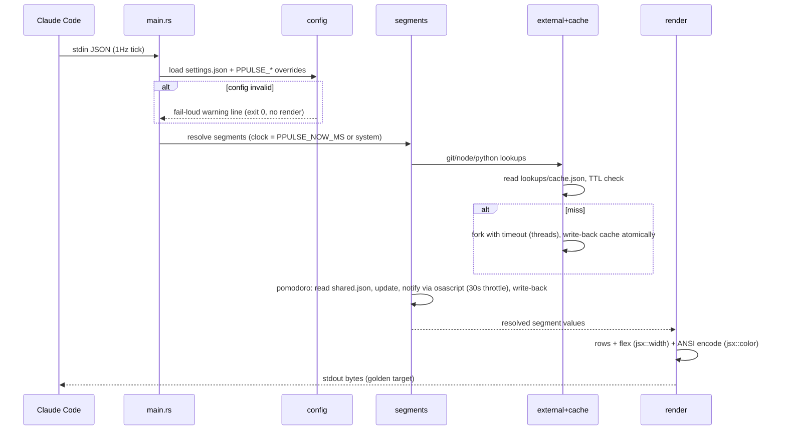
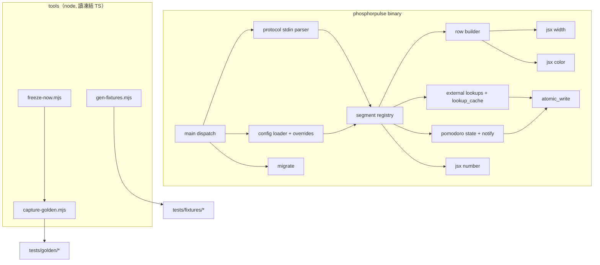

# design-be — renderer-parity（phosphorpulse Rust renderer）

Implements REQ-01..REQ-08（spec.md，指紋 571994f8…）。全新 Rust 專案，無
既有程式碼；參考實作為凍結的 phosphorflux 1.2.0（TS）。

## 1. Crate 佈局與依賴

單一 binary crate `phosphorpulse`（edition 2024，rustc 1.97）。

```
phosphorpulse/
  Cargo.toml
  src/
    main.rs            # 子命令分派（render / render --subagent / config / migrate / 無參數）REQ-01, REQ-06
    protocol.rs        # stdin JSON → RenderContext（serde；容忍缺欄位）REQ-01
    config/
      mod.rs           # 載入管線：讀檔 → PPULSE_* 覆寫 → serde 驗證 REQ-03
      overrides.rs     # PPULSE_* 規則引擎（camelCase→SCREAMING_SNAKE、陣列索引、ToNumber 強制轉換）REQ-03
      model.rs         # Config structs（接受度不嚴於 TS liteValidate）REQ-03
    jsx/               # 「JS 等價語意核心」REQ-04
      width.rs         # 移植 TS render/width.ts：cluster 切分（unicode-segmentation）＋首碼位範圍表
      number.rs        # ECMAScript ToNumber / Number.prototype.toFixed 等價演算法
      color.rs         # 色深偵測（COLORTERM/TERM）＋16/256/truecolor 編碼＋Lab/CIE76 argmin 降階
    clock.rs           # 單一時間來源：PPULSE_NOW_MS 或系統時鐘 REQ-02
    segments/
      mod.rs           # segment registry（主行 13 段＋subagent 7 段）
      simple.rs        # model/effort/dir/ctx/limit5h/limit7d/version/cost/burn（純 stdin＋clock 派生）
      external.rs      # git/node/python：fork（threads＋timeout）、pin 檔、lookups 快取 REQ-05
      lookup_cache.rs  # lookups/cache.json 讀寫（TTL、atomic write、tmp 清理）REQ-05
      pomodoro.rs      # 狀態機＋shared.json 讀寫＋osascript 通知節流 REQ-05
    render/
      mod.rs           # render 管線：segments → rows → flex 對齊 → ANSI 串接
      row_builder.rs   # row/flex 佈局（依賴 jsx::width）
      themes.rs        # 內建三主題（matrix-tron / solarized-dark / solarized-light）
    migrate.rs         # 兩檔白名單複製 REQ-06
    atomic_write.rs    # tmp＋rename＋過期 tmp 清理（pomodoro 與 lookups 共用）REQ-05
  tools/               # TS 側捕捉工具（node 腳本，讀凍結 phosphorflux）
    freeze-now.mjs     # node --import preload：覆寫 Date.now 為 FREEZE_NOW_MS
    capture-golden.mjs # 依樣本定義執行凍結 TS 版，產 expected.bin
    gen-fixtures.mjs   # 生成三張 fixture 表（寬度/toFixed+ToNumber/palette 降階）
  tests/
    golden/<sample>/   # hermetic 樣本（REQ-02 樣本契約）
    fixtures/          # js_semantics 三張表＋pomodoro/cache fixture
    golden_runner.rs  config_behavior.rs  stdin_edge.rs  js_semantics.rs
    lookup_cache.rs   pomodoro_state.rs   migrate.rs     perf_budget.rs
```

依賴（刻意最小）：`serde`＋`serde_json`（stdin/config/狀態檔）、
`unicode-segmentation`（grapheme cluster 切分）。**不用** clap（三個子命令
手寫分派）、**不用** tokio（fork 並行用 std::thread＋mpsc `recv_timeout`）、
**不用** unicode-width / 任何 color crate（REQ-04：位元對等要求移植 TS 演
算法，crate 的「正確」行為反而破對筆——spec 偏差與 Adjudications 已載）。

## 2. TS → Rust 模組對照（[NEW] 依據）

| phosphorflux（凍結參考） | phosphorpulse | REQ |
|---|---|---|
| `src/protocol/facade.ts` | `src/protocol.rs` | REQ-01 |
| `src/config/loader.ts` + `ppfOverride.ts` + `liteValidate.ts` | `src/config/*` | REQ-03 |
| `src/render/width.ts` | `src/jsx/width.rs` | REQ-04 |
| `cost.toFixed` 等散落呼叫 + `ppfOverride.coerceLike` | `src/jsx/number.rs` | REQ-04 |
| `src/color/{detectDepth,ansi,paletteAnsi,resolveColor}.ts` | `src/jsx/color.rs` | REQ-04 |
| `src/segments/*.ts`（13＋7 段） | `src/segments/*` | REQ-02, REQ-05 |
| `src/segments/lookupCacheFile.ts` | `src/segments/lookup_cache.rs` | REQ-05 |
| `src/segments/pomodoroStateFile.ts` + `pomodoroNotify.ts` | `src/segments/pomodoro.rs` | REQ-05 |
| `src/render/{index,rowBuilder,segmentColor}.ts` | `src/render/*` | REQ-02 |
| `src/config/writeAtomic.ts` | `src/atomic_write.rs` | REQ-05 |
| （無對應——TS 版無 migrate） | `src/migrate.rs` | REQ-06 |

## 3. 狀態檔 schema（Table schema）

### pomodoro/shared.json（讀不嚴於 TS `isValidPersistedDoc`；寫回同 schema）

| 欄位 | 型別 | 說明 |
|---|---|---|
| phase | string | work/break 階段（實際 TS 欄位；S-17 drift 修正 2026-08-14） |
| round | number | 回合計數 |
| phaseStartMs | number (epoch ms) | 現階段起點 |
| lastActivityMs | number (epoch ms) | 最後活動時間 |
| lastNotifiedAtMs | number \| absent | 通知節流基準（30s） |
| sessions | object&lt;sessionId, {…}&gt; | session 白名單鍵 `/^[A-Za-z0-9_-]+$/` |

（S-17 記錄：T8 執行時發現本表最初依 pomodoro.ts 參數草擬的 startedAtMs/
workMin 與真實 shared.json 持久化欄位不符；以凍結 TS 實際寫出的 fixture
為準修正。實作與測試自始對齊真實格式，僅本設計表滯後。）

### lookups/cache.json（單一讀寫者；TTL git 10s / node、python 60s）

| 欄位 | 型別 | 說明 |
|---|---|---|
| git | object&lt;cwd, Entry&gt; | 每 cwd 一項 |
| node | Entry \| absent | 全域單項 |
| python | Entry \| absent | 全域單項 |
| Entry.value | string | 段顯示值 |
| Entry.fetchedAt | number (epoch ms) | `fetchedAt > now` → miss |

### settings.json（config 契約）

欄位集合＝phosphorflux `schema/config.schema.json`（文件參考，非執行期依
賴）：`style`、`activeTemplate`、`nerdFont`、`nerdFontGlyphs`、`leanSep`、
`colorDepth`、`language`、`rows[1..3]`、`subagent.segments`、`gauge`、
`pomodoro`、`segments.<id>`。serde structs 接受度規則見 REQ-03。

## 4. Render 管線（sequence）



## 5. 元件圖（C3）



## 6. 關鍵設計決定

1. **fork 逾時**（REQ-05/REQ-07）：`std::process::Command` spawn 後由工作
   thread `wait`，主線 `mpsc::recv_timeout(timeout)`；逾時即回 fallback 值
   並棄置 child（kill＋detach 收屍 thread）。timeout 沿用 TS 值（git
   120ms、node 150ms、python 150ms、version 80ms——以 `timeouts.ts` 為準，
   實作時逐一抄值）。
2. **clock 單一來源**（REQ-02）：`clock::now_ms()` 全 codebase 唯一取時點
   （含快取 TTL、通知節流、閃爍奇偶）；`PPULSE_NOW_MS` 設定時固定回傳。
3. **capture 工具**（REQ-02）：`freeze-now.mjs` 以 `globalThis.Date.now =
   () => Number(process.env.FREEZE_NOW_MS)` 於 preload 覆寫；
   `capture-golden.mjs` 讀樣本目錄的 env.json/state fixture，組 env 後
   spawn 凍結 TS 版，stdout 原始 bytes 寫 expected.bin。樣本可重生：同輸
   入必同 bytes（S-01 的前提，panel 裁決核心）。
4. **PPULSE_* 覆寫**（REQ-03）：規則引擎移植 `ppfOverride.ts`；數值轉換走
   `jsx::number::to_number`（ECMAScript ToNumber），確保 `"0x10"`→16 等
   行為一致。
5. **錯誤路徑**（REQ-01）：壞 stdin → stderr 一行 `phosphorpulse: invalid
   stdin: <reason>`、exit 1、stdout 0 bytes。config invalid → stdout 印
   fail-loud 警告行（格式對齊 TS `render/index.ts:378`，app 名稱換
   phosphorpulse）、exit 0。
6. **migrate**（REQ-06）：白名單兩檔（settings.json、pomodoro/shared.json）
   逐檔 `fs::copy`（symlink 跟隨＝std 預設）；已存在→跳過（除非 --force）；
   逐檔結果收集後統一報告，任一失敗 exit 非零。
7. **不引入 GoF pattern**：無重複結構或可預期變異點（segment registry 是
   一張靜態表，不是 plugin 點）；過度設計違反 S-43 審查基準。

## 7. Requirements Checklist（S-51，非 gate 附錄）

- [ ] REQ-01 CLI 分派與錯誤路徑（design §1 main.rs、§6.5）
- [ ] REQ-02 hermetic golden＋capture 工具（design §1 tools/、§6.3、clock §6.2）
- [ ] REQ-03 config 載入＋PPULSE_* 引擎（design §1 config/、§6.4）
- [ ] REQ-04 jsx 三核心（design §1 jsx/、§2 對照）
- [ ] REQ-05 狀態檔＋通知＋atomic write（design §1 segments/、§3、§6.1）
- [ ] REQ-06 migrate（design §6.6）
- [ ] REQ-07 效能（無 async runtime、最小依賴、threads 並行——§1 依賴段）
- [ ] REQ-08 release（cargo-dist，tasks.md T12）
