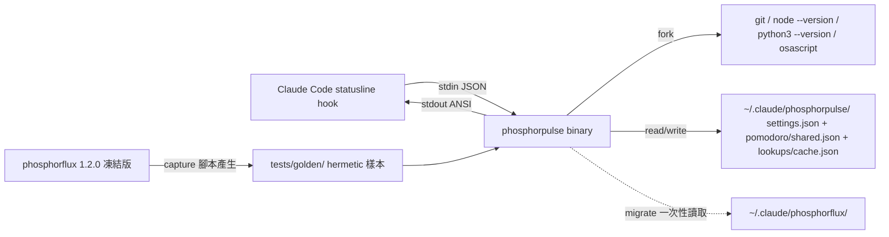

# renderer-parity — phosphorpulse Renderer 子系統（Rust 重寫 phosphorflux 1.2.0）

以 Rust 重寫 phosphorflux 1.2.0 的 renderer 子系統（`render` / `render
--subagent` / `config` 三命令），以 hermetic golden test 逐位元對等為驗收
標準。TS 版凍結為參考實作與 golden 基準。TUI 為第二個獨立變更，不在本
spec。探索交接：`sideProjects/specs/phosphorpulse/explore-notes.md`。

實測地基（2026-08-14，本機 Intel Mac）：TS 版 render median 240.87ms；
Rust spike（stdin＋serde_json＋ANSI）median 2.8ms，release binary 479KB。
TS 版自註：`node --version`/`python3 --version` 在本機 pyenv shim 下可達
80ms+（`src/segments/timeouts.ts:7-11`）——所以 lookups 快取在 Rust 版是
效能預算的必要件，不是可選件。

## System context

## Requirements

### REQ-01 CLI 介面對等（以實測行為為準）

- `render`：讀 stdin JSON，輸出主行 ANSI。config 載入失敗時**不渲染**，
  輸出 fail-loud 警告行（TS 版 `render/index.ts:378` 行為）且 exit 0；
  警告行中的應用名稱與路徑為 phosphorpulse 自身（偏差 2）。
- `render --subagent`：**僅 config 載入失敗**時 fallback 預設值並 exit 0
  （TS 版 `cli.ts:46-53`）；其他行為同 render。
- `config`：唯讀診斷輸出（解析後設定路徑與生效值/來源）。
- 無參數：印說明（TUI 未實作，指向 phosphorflux TUI 或手改 settings.json）
  並 exit 1（偏差 1）。
- **壞 stdin**（空、非 JSON、BOM）：TS 版實測是未捕捉例外、exit 1、stderr
  stack trace、stdout 0 bytes。Rust 版行為：exit 1、stdout 0 bytes、stderr
  一行結構化錯誤（不模仿 Node stack trace——偏差 5）。

### REQ-02 Hermetic golden 逐位元對等

- 對同一組 hermetic 輸入，`render` / `render --subagent` 的 stdout 與凍結
  TS 版 **byte-identical**。
- **樣本契約**（每樣本一目錄）：`stdin.json`、`settings.json`、`env.json`
  （**完整釘死**：`COLUMNS`、`TERM`、`COLORTERM`、`HOME`、config-dir 指向、
  `now_ms`）、`cwd/` fixture 目錄、`state/` fixture（pomodoro shared.json、
  lookups cache.json，`fetchedAt` 以相對 `now_ms` 表示）、`bin/` PATH 插樁
  （git/node/python3/osascript 固定輸出腳本）、`expected.bin`。執行時
  `PATH=樣本 bin 目錄`（前置），state fixture 先複製到暫存（render 會寫回）。
- **時間**：Rust 側 `PPULSE_NOW_MS` 是**所有**時刻的單一來源（rate-limit
  倒數、pomodoro、burn、快取 TTL、閃爍奇偶）。TS 捕捉側以
  `node --import freeze-now.mjs` preload 覆寫 `Date.now`（外掛 preload，
  不改凍結原始碼），凍結值＝樣本 `now_ms` → golden **可重複再生**，無
  邊界重捕捉規則。
- **執行方式**：單一 data-driven runner 走訪 `tests/golden/*/`，新增樣本
  ＝新增目錄，不新增場景。
- **涵蓋樣本（最小集）**：main-default（matrix-tron）、subagent、
  solarized-dark、solarized-light、width-stress（CJK＋旗幟 🇹🇼＋VS16 ❤️＋
  ZWJ 家族 emoji）、env-override（PPULSE_* 覆寫）、cost-burn-ties（含
  0.125 類 tie-breaking 值與字串型數值欄位）、colordepth-256 與
  colordepth-16（觸發 Lab/CIE76 降階路徑）、pomodoro-running（含 ≤5s
  閃爍奇偶各一）。

### REQ-03 Config 系統

- 預設目錄 `$HOME/.claude/phosphorpulse/`，讀 `settings.json`。
- 環境覆寫前綴為 **`PPULSE_*`**（含 `PPULSE_CONFIG_DIR`）；規則引擎與 TS
  `ppfOverride.ts` 相同（camelCase→SCREAMING_SNAKE、陣列索引、型別強制
  轉換依 ECMAScript ToNumber 語意）。**`PPF_*` 一律忽略**——避免舊變數把
  Rust 版重新指向 phosphorflux 目錄、擊穿目錄隔離（偏差 6）。
- 驗證以 serde structs 實作，接受度**不嚴於** TS `liteValidate`：所有
  liteValidate 接受且可渲染的 config，Rust 必須接受；liteValidate 接受但
  TS 渲染會 crash 的 config（如缺 `rows`），Rust 視為 invalid → fail-loud
  警告行（偏差 7，不重現 crash）。不共用 JSON Schema 檔（schema 為文件
  參考，非跨 repo 執行期契約）。
- config 載入失敗語意見 REQ-01（fail-loud，非 fallback 渲染）。

### REQ-04 JS 等價語意核心

跨語言 byte-parity 的三個已證實地雷，逐一以演算法移植＋fixture 交叉驗證：

- **顯示寬度**：移植 TS `render/width.ts` 的演算法本體（grapheme cluster
  切分＋**首碼位**查自製範圍表；旗幟/VS16 emoji 寬度＝1 是 TS 的實際行為，
  照抄，不用 unicode-width crate 的正確值）。cluster 切分用
  unicode-segmentation crate，與 ICU 的版本性分歧列為已知風險，由
  width-stress 樣本與 fixture 表覆蓋。
- **數值格式**：實作 ECMAScript `Number.prototype.toFixed` 與 `ToNumber`
  的等價演算法（`(0.125).toFixed(2)`＝"0.13"、`"0x10"`→16、`" 12 "`→12、
  `""`→0、`1e21` 的科學記號輸出）。
- **色彩降階**：256/16 色的 Lab/CIE76 argmin 降階（TS `color/ansi.ts`）
  浮點運算逐步對齊，由 colordepth 樣本把關。

交叉驗證機制：一次性腳本從凍結 TS 生成 fixture 表（tricky cluster 寬度表、
toFixed/ToNumber 輸入輸出表、palette 降階表），Rust 單元測試逐列比對。

### REQ-05 狀態檔與通知

- `pomodoro/shared.json`：Rust 讀取接受度**不嚴於** TS
  `isValidPersistedDoc`（invalid → 視為無狀態，同 TS）；寫回 schema 與 TS
  相同（遷移後 TS 版仍可讀）。atomic write（tmp＋rename）＋**清理本目錄
  過期 `*.tmp-*`**（TS 版已知會遺留垃圾 tmp 檔，Rust 修正之，stdout 無
  可觀測差異——偏差 8）。
- **Pomodoro 桌面通知**：功能對等（macOS `execFile osascript` 等價呼叫、
  `lastNotifiedAtMs` 30s 節流）；測試以 PATH 插樁 osascript 驗證呼叫與
  節流，不真發通知。
- `lookups/cache.json`：git 每 cwd TTL 10s、node/python 全域 TTL 60s、
  `fetchedAt > now` 視為 miss、atomic write＋tmp 清理。單一讀寫者（目錄
  隔離、不遷移），不要求與 TS 檔案級互通；64KB 上限與 prune-on-write 不
  移植（偏差 9）。
- **過渡規則**：同一時間只切一個實作（`~/.claude/settings.json` 的
  statusLine 一次性切換）；兩實作各自目錄並存不互踩，但同時使用會有雙
  pomodoro/雙通知——文件明示「切換即遷移，不並用」。

### REQ-06 一次性遷移指令

- `migrate`：只複製 `settings.json` 與 `pomodoro/shared.json` 兩個檔
  （**排除** `*.tmp-*`、歷史 `<uuid>.json`、`lookups/`）。
- 目標檔已存在 → 不覆蓋、明說、exit 0；`--force` → 覆蓋。
- 來源不存在/不可讀（EACCES）→ 明確訊息、exit 非零。部分失敗（一檔成功
  一檔失敗）→ 報告各檔結果、exit 非零、不回滾（檔案各自獨立）。symlink
  來源：跟隨讀內容複製為一般檔。

### REQ-07 效能預算（可判別的 gate）

- **Gate**：hermetic 樣本（PATH 插樁、預熱 cache fixture）下 `render`
  20 次 median ≤ **30ms**。
- **Report-only**：冷快取＋真實 git/node/python3 fork 的 20 次 median 實數
  引述（不 gate；對照 TS 240.87ms）。
- S-12 的 GIVEN 必須釘死快取狀態與 PATH（消除「同一測試 5ms 或 150ms」的
  不定性）。

### REQ-08 Release 工程

- GitHub Actions + cargo-dist：tag push 產出 4 平台 binary（macOS x86_64 /
  arm64、Linux x86_64、Windows x86_64）＋ SHA256 checksums。
- **Byte-parity gate 只在本機（macOS x86_64，capture 機）宣告**；Linux CI
  跑單元/fixture 測試與 golden（golden 於 Linux 為 report-only，通過則升
  級宣告）；Windows：能編譯、`render` 能輸出即可（偏差 3）。
- 本機無 gh CLI，release 觸發與確認走 GitHub 網頁。

## 偏差清單（與 100% 對等的已知例外，核准即接受）

1. 無參數啟動：TS 開 TUI，本變更印說明並 exit 1（TUI 為第二變更）。
2. fail-loud 警告行與 `config` 命令輸出中的應用名稱/路徑欄位：印
   phosphorpulse 自身；比對採佔位符正規化。
3. Windows：能編譯能輸出，不納入 byte-parity gate。
4. TS 凍結原始碼不修改；golden 捕捉用外掛 `node --import` preload 凍結
   `Date.now`（非原始碼 hook）。
5. 壞 stdin：exit 1 與空 stdout 對等，stderr 為一行結構化錯誤，不模仿
   Node stack trace。
6. 環境變數前綴改 `PPULSE_*`，`PPF_*` 一律忽略（目錄隔離優先）。
7. liteValidate 接受但 TS 渲染會 crash 的 config（如缺 rows）：Rust 視為
   invalid fail-loud，不重現 crash。
8. pomodoro tmp 檔垃圾遺留：Rust 修正（清理過期 tmp），stdout 無差異。
9. lookups/cache.json 的 64KB 上限與 prune-on-write 不移植（單一讀寫者）。

## Scenarios

### S-01 Hermetic golden runner 逐位元對等

- GIVEN `tests/golden/*/` 全部樣本（REQ-02 樣本契約與最小集，expected.bin
  由凍結 TS＋freeze-now preload 捕捉）
- WHEN runner 對每個樣本以其 env/PATH 插樁/cwd/state fixture/`PPULSE_NOW_MS`
  執行 `phosphorpulse render`（或樣本標記的 `render --subagent`）
- THEN 每個樣本 stdout 與 expected.bin byte-identical、exit 0；任一樣本
  失敗時報告樣本名與首個差異位元組偏移
- Test mapping: `tests/golden_runner.rs::test_s01_all_golden_samples`
- Verification command: `~/.cargo/bin/cargo test --test golden_runner test_s01`

### S-02 Config 解析、fail-loud 與 subagent fallback

- GIVEN 三案例：(a) 未設 `PPULSE_CONFIG_DIR` 且暫存 HOME 下預設目錄有合法
  settings.json；(b) `PPULSE_CONFIG_DIR` 指向自訂目錄且環境同時設有
  `PPF_CONFIG_DIR` 指向他處；(c) config 為壞 JSON
- WHEN 分別執行 `phosphorpulse config`（a、b）與 `phosphorpulse render`、
  `phosphorpulse render --subagent`（c）
- THEN (a) 解析路徑＝預設目錄；(b) 解析路徑＝`PPULSE_CONFIG_DIR` 所指、
  `PPF_CONFIG_DIR` 無效果；(c) render 輸出 fail-loud 警告行且 exit 0、不
  渲染，`--subagent` 以預設 config 渲染非空且 exit 0
- Test mapping: `tests/config_behavior.rs::test_s02_config_resolution_and_fallback`
- Verification command: `~/.cargo/bin/cargo test --test config_behavior test_s02`

### S-03 壞 stdin 行為

- GIVEN 空 stdin、非 JSON stdin、含 BOM 的 JSON stdin 三案例，合法 config
- WHEN 執行 `phosphorpulse render` 與 `phosphorpulse render --subagent`
- THEN 空/非 JSON：exit 1、stdout 0 bytes、stderr 恰一行含 "stdin" 的錯誤；
  BOM 案例：與 TS 版行為一致（捕捉 TS 實測結果寫入本測試的斷言常數）
- Test mapping: `tests/stdin_edge.rs::test_s03_malformed_stdin`
- Verification command: `~/.cargo/bin/cargo test --test stdin_edge test_s03`

### S-04 JS 等價語意 fixture 交叉驗證

- GIVEN 由凍結 TS 一次性生成的三張 fixture 表：寬度表（CJK/旗幟/VS16/ZWJ/
  控制序列）、toFixed/ToNumber 表（tie 值、十六進位字串、空字串、1e21）、
  palette 降階表（256/16 色 argmin）
- WHEN Rust 對應函式逐列計算
- THEN 全列相等；任何不等列出 fixture 行號與兩側值
- Test mapping: `tests/js_semantics.rs::test_s04_width_number_palette_fixtures`
- Verification command: `~/.cargo/bin/cargo test --test js_semantics test_s04`

### S-05 外部查詢與 lookups/cache.json 語意

- GIVEN 暫存 config 目錄無 cache.json；PATH 插樁 git/node/python3（固定
  輸出、呼叫計數）；cwd 為插樁 git repo；`PPULSE_NOW_MS` 固定
- WHEN 連續執行兩次 `phosphorpulse render`；再以 `PPULSE_NOW_MS` 前移超過
  TTL 執行第三次；再以 `fetchedAt > now` 的手工 cache 執行第四次
- THEN 第一次後 cache.json 存在且結構正確（git 依 cwd 鍵、node/python 全
  域鍵）；第二次 0 fork；第三次重新 fork 並更新 fetchedAt；第四次視為
  miss 重新 fork；目錄中無殘留過期 `*.tmp-*`
- Test mapping: `tests/lookup_cache.rs::test_s05_cache_ttl_semantics`
- Verification command: `~/.cargo/bin/cargo test --test lookup_cache test_s05`

### S-06 Pomodoro 狀態相容與通知節流

- GIVEN TS 版寫出的真實 shared.json fixture（含 sessions map）；PATH 插樁
  osascript（呼叫記錄）；`PPULSE_NOW_MS` 設於工作段結束後、
  `lastNotifiedAtMs` 30s 內與 30s 外兩案例
- WHEN 執行 `phosphorpulse render`（settings 含 pomodoro 段）
- THEN pomodoro 段渲染與 golden 一致；寫回檔通過 TS schema（isValidPersistedDoc
  等價）；30s 內案例 osascript 0 次呼叫、30s 外恰 1 次且 lastNotifiedAtMs
  更新；invalid fixture 案例視為無狀態不 crash
- Test mapping: `tests/pomodoro_state.rs::test_s06_pomodoro_compat_and_notify`
- Verification command: `~/.cargo/bin/cargo test --test pomodoro_state test_s06`

### S-07 migrate 遷移語意

- GIVEN 暫存 HOME：`~/.claude/phosphorflux/` 含 settings.json、
  pomodoro/shared.json、垃圾 `shared.json.tmp-123`、歷史 `abc.json`、
  `lookups/cache.json`；目標目錄不存在
- WHEN 依序執行 `migrate`、`migrate`（第二次）、`migrate --force`、以及
  來源目錄不存在與來源檔 chmod 000 兩個失敗案例
- THEN 第一次只複製兩個目標檔（tmp/uuid/lookups 都不出現在目標）；第二次
  不覆蓋、明說、exit 0；`--force` 覆蓋；失敗案例訊息明確且 exit 非零；
  部分失敗回報各檔結果且 exit 非零
- Test mapping: `tests/migrate.rs::test_s07_migrate_semantics`
- Verification command: `~/.cargo/bin/cargo test --test migrate test_s07`

### S-08 效能預算

- GIVEN release build；hermetic 樣本 main-default（PATH 插樁、預熱 cache
  fixture）；另一組冷快取＋真實 PATH 環境
- WHEN 各執行 21 次（棄首次）計 20 次 wall time
- THEN hermetic 組 median ≤ 30ms（gate），兩組 min/median/max 實數皆印出
- Test mapping: `tests/perf_budget.rs::test_s08_render_median_budget`
- Verification command: `~/.cargo/bin/cargo build --release && ~/.cargo/bin/cargo test --test perf_budget test_s08 -- --nocapture`

### S-09 [MANUAL] Release CI 四平台產物

- GIVEN cargo-dist 設定完成並 push tag 到 GitHub repo
- WHEN GitHub Actions release workflow 跑完
- THEN release 頁面掛出 4 平台 binary＋SHA256 checksums；macOS x86_64 資產
  下載後本機可執行且 checksum 相符
- 理由：需要 GitHub 遠端 CI 與網頁操作（本機無 gh CLI），無法本機自動化。
- Test mapping: none（manual scenario）
- Verification command: manual — GitHub release 頁面核對 4 資產＋checksums；
  本機 `shasum -a 256` 比對後執行 `./phosphorpulse render < stdin.json`

### S-10 [MANUAL] 本機實機切換

- GIVEN `~/.claude/settings.json` 的 statusLine 命令改指 phosphorpulse
  binary（一次性切換，依 REQ-05 過渡規則先跑 migrate）
- WHEN 使用中的 Claude Code session 下一個 1Hz tick
- THEN statusline 顯示與 phosphorflux 視覺一致、無明顯延遲；pomodoro 狀態
  延續（遷移生效）
- 理由：真實 Claude Code 進程的端到端視覺確認，屬互動觀察。
- Test mapping: none（manual scenario）
- Verification command: manual — 切換 settings.json 後並排比對實際顯示

## Requirements Checklist（非 gate 附錄）

- [ ] REQ-01 CLI 介面（含壞 stdin 偏差、fail-loud 實測語意）
- [ ] REQ-02 hermetic golden（樣本契約完整釘死環境/狀態/時間；可重生）
- [ ] REQ-03 config（PPULSE_* 前綴、PPF_* 忽略、serde 驗證接受度規則）
- [ ] REQ-04 JS 等價語意核心（寬度移植、toFixed/ToNumber、色彩降階＋fixture）
- [ ] REQ-05 狀態檔＋通知＋過渡規則
- [ ] REQ-06 migrate（白名單複製＋失效分類）
- [ ] REQ-07 效能 gate 可判別（hermetic gate＋冷路徑 report）
- [ ] REQ-08 release 四平台＋checksums＋gate 範圍宣告
- [ ] 偏差清單完整（9 項）

## Rejected options

- bash 重寫：實測 118.76ms 達標一半，但不可維護、無型別、無測試生態 → 棄
- 繼續優化 TS：fork-cache 已證明只省 ~8ms，boot+module load 碰不到 → 棄
- bun runtime / bun --compile：本機實測比 node 慢 20-41% → 棄
- 部分改寫（只把 git.ts/node.ts 換 Rust）：fork 非 serialized 成本，0 收益 → 棄
- npm 包裝 binary 分發：使用者裁決走 GitHub release → 棄
- 共用 ~/.claude/phosphorflux config 目錄：使用者裁決獨立目錄 + 遷移 → 棄
- 一個 spec 全包 renderer+TUI（選項 B）：gate 巨大、golden 與互動測試混雜 → 棄
- 修改 TS 凍結原始碼加時間 hook：違反凍結原則 → 棄（改用外掛 preload 凍結）
- 捕捉時刻記錄＋分鐘邊界重捕捉：粒度錯（秒級＋奇偶秒閃爍）、不可重生 → 棄
- 沿用 `PPF_*` 環境前綴：`PPF_CONFIG_DIR` 會把 Rust 版重新指向舊目錄，
  擊穿隔離 → 棄
- 共用 JSON Schema 為執行期契約：TS 執行期實際用生成的 liteValidate，
  共用是假重用真耦合 → 棄
- unicode-width crate 算寬度：與 TS 自製首碼位範圍表在旗幟/VS16 上分歧
  （1 vs 2），會破 byte-parity → 棄（移植 TS 演算法）
- migrate 以 README `cp -n` 取代子命令：使用者裁決要遷移指令 → 棄（但語
  意簡化為兩檔白名單複製）

## Adjudications

三鏡片全 panel（elf-archer 正確性 / orc-saboteur 失效模式 / hobbit-gardener
簡化，2026-08-14，均 opus）對 v1 草稿的合議與 Maia 裁決：

- REQ-01: REFUTED →（elf/orc 各實測 3 個 crash）「不 panic 不 exit 非零」
  與「--subagent 任何錯誤 exit 0」不符凍結版實測 → 改寫為實測語意＋偏差 5。
- REQ-02: REFUTED →（三鏡片共識）分鐘邊界重捕捉粒度錯 60 倍、樣本缺
  COLUMNS/TERM/COLORTERM/PATH/cwd/state、capture 自身寫回狀態、fork race
  嵌進 expected.bin → 全 hermetic 樣本契約＋freeze-now preload＋單一
  data-driven runner（併掉 v1 S-01..S-05）。
- REQ-03: REFUTED →（orc）PPF_CONFIG_DIR 擊穿隔離 → PPULSE_* 前綴；
  （elf/gardener）「共用 schema」與「liteValidate 等價」互斥且假重用 →
  serde structs＋接受度不嚴於 liteValidate＋偏差 7；（orc）v1 S-07 描述
  了不存在的 fallback 渲染 → 依實測 fail-loud 改寫。
- REQ-04（v1 狀態檔）: 部分 REFUTED →（gardener/orc）目錄隔離後無共用
  檔，「互不破壞」條款無對象；64KB/prune/race-loser 無觀測效果 → 砍
  （偏差 9）；快取本體因 fork >80ms 實測保留；（orc）osascript 通知完全
  漏列 → 新增 REQ-05 通知條款；tmp 垃圾為 TS 已知缺陷 → Rust 修正（偏差 8）。
- REQ-05（v1 migrate）: REFUTED →（orc）會複製垃圾 tmp/歷史檔、無失效分
  類；（gardener）建議砍成 cp -n 但使用者已裁決要指令 → 保留子命令、改
  兩檔白名單＋失效分類（REQ-06）。
- REQ-06（v1 效能）: REFUTED →（elf，D6）50ms 對 2.8ms spike 無判別力且
  GIVEN 未釘快取/PATH → hermetic gate 30ms＋冷路徑 report-only（REQ-07）。
- REQ-07（v1 release）: REFUTED →（elf）golden 內嵌本機環境，Linux gate
  宣告不成立 → gate 限縮本機、Linux report-only 可升級；（orc）補
  checksums（REQ-08）。
- 新增 REQ-04（JS 等價語意核心）：（elf 實測）toFixed tie 值 0.13 vs
  0.12、ToNumber "0x10"/" 12 "/""、旗幟/VS16 寬度 1 vs 2 → 演算法移植＋
  TS 生成 fixture 交叉驗證。
- 殘餘已知風險（接受）：unicode-segmentation vs ICU 的 cluster 切分版本
  性分歧（GB9c 等）——由 width-stress 樣本與 fixture 表覆蓋，未涵蓋處
  待實測；serde_json 對 lone surrogate/重複鍵/64-bit 溢位整數與 JS 的
  差異——golden 樣本以真實 Claude Code stdin 為準，極端 JSON 不在對等
  範圍。
