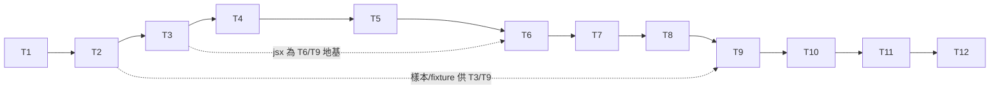

# tasks — renderer-parity

任務順序＝依賴順序。TDD 任務全標 `[NEW]`（全新專案，無既有實作可 MODIFY；
參考 file:line 指 phosphorflux 凍結版）。驗證命令中 cargo 一律用
`~/.cargo/bin/cargo`，工作目錄 `~/Desktop/FullStack/sideProjects/phosphorpulse/`。

## Tasks

- [x] T1 `[INFRA]` cargo 專案鷹架
  - 理由：無場景 ID 的基礎建設——`cargo init`、Cargo.toml（serde/serde_json/
    unicode-segmentation）、src/ 模組空殼、tests/ 目錄結構，無可測行為。
  - 驗證：`~/.cargo/bin/cargo build` 通過；`~/.cargo/bin/cargo test` 0 測試通過。

- [x] T2 `[INFRA]` TS 側捕捉工具與 fixture/golden 生成
  - 理由：無場景 ID 的測試資產生產——tools/freeze-now.mjs、
    capture-golden.mjs、gen-fixtures.mjs，執行後產出 tests/golden/ 十個樣本
    （REQ-02 最小集）與 tests/fixtures/ 三張表。工具正確性由下游 S-01/S-04
    測試間接把關。
  - 驗證：十個樣本目錄齊備各含 expected.bin 非空；同一樣本連續 capture 兩次
    bytes 相同（可重生性，引述 `cmp` 結果）；三張 fixture 表非空。

- [x] T3 `S-04` [NEW] JS 等價語意核心（jsx/width.rs、number.rs、color.rs）
  - RED：寫 `tests/js_semantics.rs::test_s04_width_number_palette_fixtures`
    逐列比對三張 fixture 表 → Verify RED（模組空殼，斷言失敗）
  - GREEN：移植 width.ts 演算法、實作 ToNumber/toFixed、移植色深偵測與
    Lab/CIE76 降階 → Verify GREEN
  - REFACTOR：SOLID＋DRY 檢查（範圍表資料與演算法分離；三模組無互相依賴）
  - Spec re-check
  - 驗證：`~/.cargo/bin/cargo test --test js_semantics test_s04`

- [x] T4 `S-02` [NEW] config 載入、PPULSE_* 覆寫、fail-loud
  - RED：`tests/config_behavior.rs::test_s02_config_resolution_and_fallback`
    （spec 三案例 a/b/c）→ Verify RED
  - GREEN：config/model.rs＋overrides.rs＋mod.rs；PPF_* 忽略；fail-loud 警
    告行；--subagent config 失敗 fallback → Verify GREEN
  - 追加斷言（eagle round-1 advisory：S-02 THEN 只驗路徑）：案例 (a)(b)
    的 `config` 輸出同時斷言生效值與來源標示（REQ-01 對 config 命令的承諾）
  - REFACTOR：SOLID＋DRY → Spec re-check
  - 驗證：`~/.cargo/bin/cargo test --test config_behavior test_s02`

- [x] T5 `S-03` [NEW] 壞 stdin 行為＋CLI 邊界（含無參數行為）
  - RED：`tests/stdin_edge.rs::test_s03_malformed_stdin`（空/非 JSON/BOM；
    BOM 案例斷言常數先以凍結 TS 實測取得並寫入測試註解）＋同檔
    `test_req01_no_args_exit1`（無參數 → 印說明、exit 1；REQ-01 偏差 1。
    spec 無專屬 S-XX——指紋已鎖，補場景需重核准，故以 REQ 級測試落於本
    檔，eagle round-1 缺口 (a) 的修正）→ Verify RED
  - GREEN：protocol.rs 錯誤路徑（exit 1、stdout 0 bytes、stderr 一行）＋
    main.rs 無參數分支 → Verify GREEN
  - REFACTOR → Spec re-check
  - 驗證：`~/.cargo/bin/cargo test --test stdin_edge`

- [x] T6 `[INFRA]` simple segments、row builder、themes、ANSI 串接
  - 範圍限定：僅 9 個純 stdin＋clock 派生段（model/effort/dir/ctx/limit5h/
    limit7d/version/cost/burn）＋subagent 7 段＋row builder＋themes＋ANSI
    串接。external（git/node/python）歸 T7、pomodoro 歸 T8——無前向依賴
    （eagle round-1 advisory (b) 的修正）。
  - 理由：這些模組的**行為**正確性完全由 T9 的 golden byte-parity gate 驗
    收（S-01 是它們的場景歸屬，非逃避 TDD）；本任務的單元測試只做組裝煙霧
    測試，避免與 golden 重複斷言。
  - 單元測試檔（具名，eagle round-1 (e) 的修正）：
    `tests/unit_segments.rs::test_simple_segments_smoke`、
    `tests/unit_rowbuilder.rs::test_flex_layout_smoke`、
    `tests/unit_themes.rs::test_builtin_themes_load`
  - 驗證：`~/.cargo/bin/cargo test --test unit_segments --test unit_rowbuilder --test unit_themes`

- [x] T7 `S-05` [NEW] 外部查詢與 lookups 快取
  - RED：`tests/lookup_cache.rs::test_s05_cache_ttl_semantics`（四步：寫入/
    命中 0 fork/TTL 過期重 fork/fetchedAt>now 視 miss；PATH 插樁計數）→
    Verify RED
  - GREEN：segments/external.rs＋lookup_cache.rs＋atomic_write.rs（含過期
    tmp 清理）→ Verify GREEN
  - REFACTOR → Spec re-check
  - 驗證：`~/.cargo/bin/cargo test --test lookup_cache test_s05`

- [x] T8 `S-06` [NEW] pomodoro 狀態相容與通知節流
  - RED：`tests/pomodoro_state.rs::test_s06_pomodoro_compat_and_notify`
    （TS 真實 fixture、osascript 插樁、30s 內/外、invalid fixture）→
    Verify RED
  - GREEN：segments/pomodoro.rs（讀不嚴於 isValidPersistedDoc、寫回同
    schema、節流）→ Verify GREEN
  - REFACTOR → Spec re-check
  - 驗證：`~/.cargo/bin/cargo test --test pomodoro_state test_s06`

- [x] T9 `S-01` [NEW] hermetic golden runner（整合）
  - RED：`tests/golden_runner.rs::test_s01_all_golden_samples`（data-driven
    走訪 tests/golden/*/，逐樣本組 env/PATH/state/cwd 執行 binary 比對
    bytes）→ Verify RED（樣本存在但渲染尚未逐位元對齊）
  - GREEN：補齊/修正 render 管線直到十樣本全綠（依賴 T3-T8 全部完成）→
    Verify GREEN
  - REFACTOR → Spec re-check
  - 驗證：`~/.cargo/bin/cargo test --test golden_runner test_s01`

- [x] T10 `S-07` [NEW] migrate 遷移語意
  - RED：`tests/migrate.rs::test_s07_migrate_semantics`（白名單/冪等/
    --force/失敗分類）→ Verify RED
  - GREEN：migrate.rs → Verify GREEN
  - REFACTOR → Spec re-check
  - 驗證：`~/.cargo/bin/cargo test --test migrate test_s07`

- [x] T11 `S-08` [NEW] 效能預算
  - RED：`tests/perf_budget.rs::test_s08_render_median_budget`（hermetic
    gate ≤30ms＋冷路徑 report-only）→ Verify RED（未 build release 時失敗
    於前置檢查）
  - GREEN：release build＋量測通過 → Verify GREEN（引述兩組 min/median/max）
  - REFACTOR → Spec re-check
  - 驗證：`~/.cargo/bin/cargo build --release && ~/.cargo/bin/cargo test --test perf_budget test_s08 -- --nocapture`

- [x] T12 `[INFRA]` cargo-dist 與 release workflow
  - 理由：CI 設定檔無本機可測行為（S-09 為 MANUAL 驗收）；本任務只產
    dist 設定與 GitHub Actions workflow 檔。
  - 驗證：`~/.cargo/bin/cargo dist plan`（或等效 dry-run）輸出含 4 平台
    target；workflow YAML 通過 `~/.cargo/bin/cargo dist generate` 一致性。

## 任務依賴

（實際依賴：T2 產物餵 T3/T9；T3 是 T6/T9 地基；其餘為建議串行——單一
builder 情境下避免同檔並行。）

## Manual verification checklist（stdd-execute 完成 gate 逐項確認）

- [x] S-09 Release CI 四平台產物＋SHA256 — 使用者確認 2026-08-15：release
      v0.0.1 四資產＋sha256 齊全（觸發修正：需推版本 tag，v0.0.1，
      Cargo.toml 同步降版）
- [x] S-10 本機實機切換 — 使用者確認 2026-08-15：migrate 成功、statusline
      切換顯示正常；發現並修復 subagent 名字缺失（transcript-sibling meta
      解析，commit 1b69769），修後實機 dispatch ranger-pathfinder 顯示確認

## D5 遞延

無（0/10，0%）——所有自動化場景皆入任務，無使用者遞延項。

## Notes（plan 階段已知事項）

- spec.md REQ-07 內文殘留一處舊編號「S-12 的 GIVEN」，實指 S-08（eagle
  round-1 advisory）。spec 指紋已鎖，屬 cosmetic，留待下次合法重開 spec
  時修正；本檔任務不受影響（T11 正確對 S-08）。
- design-be §6.1 的 timeout 數值已由 Maia 對凍結 TS `timeouts.ts:14-17`
  實測核對：git 120 / node 150 / python 150 / version 80，正確。
- **/codex:review 收尾迴圈記錄（2026-08-14/15，8 輪）**：修復 1×P1（gauge
  1e300 panic）＋輪 5 P1（wrapper 孫進程逾時卡死 render，10.4s→0.57s
  fail-then-pass）＋8×P2（row/segment 色值 panic、named color、跨平台
  kill、fallback rows lookup 探索、pipe 排水假逾時、pin-only 抹快取、
  Windows rename 靜默失敗、workMin 下限）。誤報駁回 2 件（pomodoro 64KB
  上限——TS `pomodoroStateFile.ts:51,126` 本有同 cap；leanSep——TS 端到
  端實測本就忽略，修復已退回為 bug-for-bug parity，見
  `tests/review_fixes.rs::test_leansep_ignored_like_ts`）。**接受殘餘**（偏
  差 3 Windows best-effort）：Windows 的 delete-then-rename 替換存在
  crash 窗口，完整原子替換需 Windows-only 依賴且本機不可測，留待實際
  Windows 使用者出現時處理。回歸測試集：`tests/review_fixes.rs`（10 測試）。
