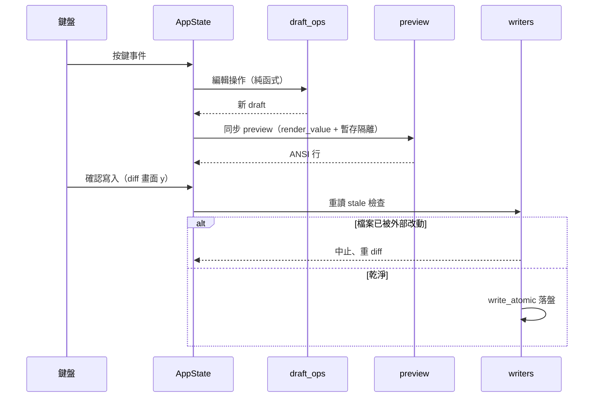
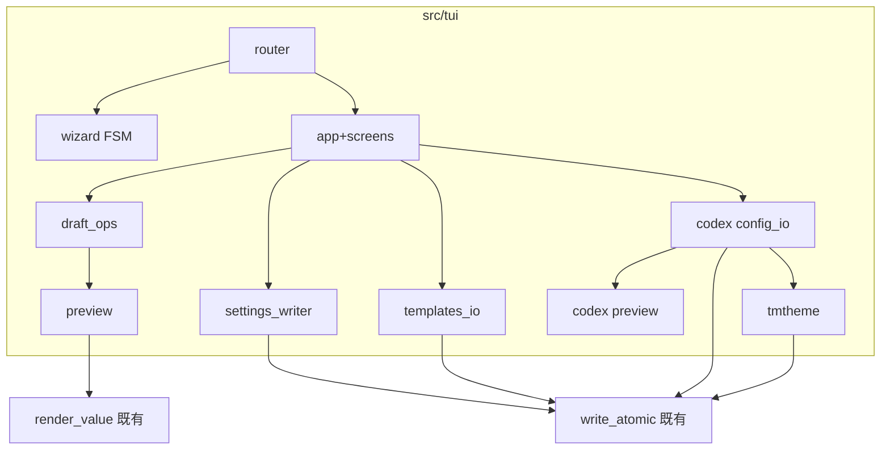

# design-be — tui（ratatui TUI 模組設計）

Implements REQ-01..REQ-09（spec.md，指紋 94d05046…）。UI 行為權威在
design-ux.md（0034ede5…）；本檔只管模組切分、資料形狀與 IO 邊界。
design-fe.md 與 api.yml：N/A（終端 UI、無 HTTP 契約）。

## 1. 模組佈局（全 [NEW]，掛在既有 crate 下）

```
src/tui/
  mod.rs          # 入口 run_tui()：terminal setup/teardown、事件迴圈 REQ-01
  router.rs       # 三態路由（Wizard/MainMenu/ErrorScreen）REQ-01
  app.rs          # AppState：draft、focus、當前畫面、lang REQ-03
  draft_ops.rs    # 純函式：rows/segments/colors/pomodoro 編輯操作 REQ-03
  wizard.rs       # 六態 FSM（純邏輯）＋動作序列輸出 REQ-02
  i18n.rs         # Key enum＋t(lang,key,params)；en/zh-TW 成對 REQ-05
  chrome.rs       # 標題列（含 version）、KeyHint 列 REQ-06
  screens/        # 8 個畫面的 ratatui 繪製＋鍵位處理（薄層，邏輯在 draft_ops）
  preview.rs      # PreviewPane：同步呼叫 render_value、暫存目錄隔離 REQ-04
  settings_writer.rs  # ~/.claude/settings.json 區塊 upsert＋SaveExit 改寫 REQ-03
  templates_io.rs # memento 另存/載入/匯出/匯入 REQ-03
  codex/
    config_io.rs  # toml_edit 三鍵讀寫＋stale 檢查 REQ-07
    preview.rs    # 單行模擬渲染（讀 tmTheme scope 色）REQ-07
    tmtheme.rs    # plist 讀寫、前綴匹配解析、split 操作 REQ-08
```

依賴新增：ratatui、crossterm、toml_edit、plist（spec 獲准）。

## 2. 重用/修改（survey 落地）

| 目標 | 位置 | 用法 |
|---|---|---|
| 原子寫 | `src/atomic_write.rs:8 write_atomic` | 四種外部檔全走它（REQ-09） |
| config 載入/驗證 | `src/config/mod.rs:53 load`、`model.rs:33 validate_renderable` | S-01 round-trip 的讀端 |
| 渲染入口 | `src/render/mod.rs:125 render_value` | preview 同步呼叫（REQ-04） |
| 時鐘 | `src/clock.rs:1 now_ms` | preview 樣本時刻固定 |
| ANSI/hex | `render/mod.rs:34 color`、`jsx/color.rs:25 downgrade` | 色塊 swatch 與 codex preview |
| [MODIFY] 無參數分支 | `src/main.rs:34-39 no_args` | TTY→run_tui()；非 TTY→現行為（S-15 回歸契約） |
| [MODIFY] 依賴 | `Cargo.toml:10-13` | 加四個 crate |

## 3. 資料形狀（Table schema）

### Draft（TUI 內部編輯態，存檔即 own config settings.json）
| 欄位 | 型別 | 說明 |
|---|---|---|
| activeTemplate/nerdFont/leanSep/colorDepth/language | 同 config model | 直接沿用 renderer 的 Config 結構（單一真相，不另造） |
| rows / subagent / gauge / segments / pomodoro | 同 config model | draft_ops 對其操作 |

### codex config（toml_edit Document，僅三鍵視圖）
| 鍵 | 型別 | 說明 |
|---|---|---|
| tui.status_line | array<string> | 已知八 id＋unknown 保留 |
| tui.status_line_use_colors | bool | toggle |
| tui.theme | string | 檔名 stem |

### tmTheme（plist Value 樹，色彩視圖）
| 項 | 說明 |
|---|---|
| settings[0].settings.foreground/background | 全域色 |
| settings[i].scope + settings.foreground | scope 條目；selector 逗號拆分、最長前綴匹配 |
| split 操作 | 為四個 Codex scope 插入專屬 dict（初值＝原解析色） |

## 4. 關鍵流程（sequence）



## 5. C3（元件）



## 6. 設計決定

1. **畫面薄、邏輯純**：screens/ 只做繪製與鍵位轉發，可測邏輯全在
   draft_ops/wizard/writers（S-09/S-16 因此免終端 IO）。
2. **Screen trait**（唯一模式引入，符合 S-43「重複結構」門檻：8 個畫面
   同構——draw(frame,&state)＋on_key(event,&mut state)->Action）。
3. **Config 結構重用 renderer 的 model**：draft 不另造型別（D2 單一真相）。
4. **stale 檢查實作**：讀時存 bytes 快照，寫前重讀比對 bytes；不同→
   AbortStale 錯誤。
5. **preview 隔離**：以 env 注入暫存 config dir 路徑呼叫 render_value 的
   包裝（renderer 已支援 PPULSE_CONFIG_DIR 語意——in-process 版以參數
   傳遞，不動全域 env）。若 render_value 現簽名不足以注入路徑，允許
   [MODIFY] render/mod.rs 增加參數化入口（不改既有公開行為）。
6. **TTY 偵測**：`std::io::IsTerminal`（std，免新依賴）。

## Requirements Checklist（S-51 附錄）

- [ ] REQ-01 router+TTY 分支（§1 router、§2 no_args MODIFY）
- [ ] REQ-02 wizard FSM（§1 wizard）
- [ ] REQ-03 七畫面＋draft_ops＋writers（§1、§6.1）
- [ ] REQ-04 preview 同步＋隔離（§1 preview、§6.5）
- [ ] REQ-05 i18n Key enum（§1 i18n）
- [ ] REQ-06 chrome version（§1 chrome）
- [ ] REQ-07 codex config_io＋preview（§1 codex/）
- [ ] REQ-08 tmtheme 解析/split（§1 codex/tmtheme）
- [ ] REQ-09 write_atomic 全覆蓋＋stale（§2、§6.4）
