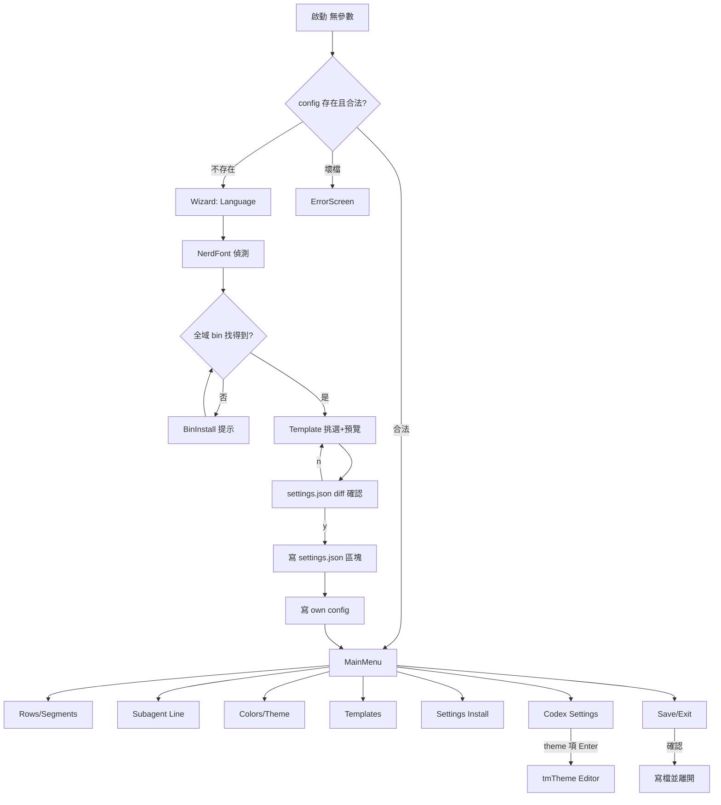

# design-ux — phosphorpulse TUI（ratatui 全畫面對等＋三新增）

設計來源：Class 3（純文字）。無外部 guideline、無視覺參考——記錄
「no reference provided, using default judgment」；**MASTER 基準＝凍結 TS
TUI 的實際行為**（畫面地圖見 explore 盤點，file:line 存於 handoff）。
REQ-XX 由後續 stdd-spec 指派；本檔各節引用需求清單 R1-R14（附錄），spec
須建立 R↔REQ 對照。

## MASTER（全域慣例）

- **佈局骨架**（每畫面同構）：標題列（畫面名＋左上 `phosphorpulse
  v{version}`——R9，TS 版沒有、本版新增）→ 內容區（list 或表單）→
  KeyHint 列（當前可用鍵位，i18n）→ 底部 dock 的 PreviewPane（R4；
  Codex 畫面改用單行 Codex preview，見 override）。
- **鍵位慣例**（沿 TS）：`↑/↓` 移動焦點、`Enter` 選取/進入、`Esc` 返回
  上層、`←/→` 調值/切換、字母鍵為畫面內動作（a 新增、i 插入、d 刪除、
  s 存、l 載入、e 匯出、w 寫入）。互動狀態：focused（反白＋前景 accent）、
  selected（前綴 `▸`）、disabled（dim）、editing（底線游標）——每畫面
  KeyHint 隨狀態切換。
- **色彩 tokens**（TUI chrome，沿 renderer matrix-tron 語彙）：
  `accent=#00FF41`（焦點/標題）、`accent2=#00CDCD`（次要強調）、
  `text=#00CF41`、`dim=#008F11`（提示/停用）、`warn=#FF7F50`、
  `error=#FF3737`、背景=終端預設（不強制塗底，對比依終端主題，WCAG AA
  以亮暗兩型終端各自可讀為準：accent 對黑底對比 >7:1、深色 dim 僅用於
  非關鍵提示）。
- **字級層次**：終端單字級——層次以「粗體＋accent（標題）／一般 text
  （內容）／dim（輔助）」表達；每畫面恰一個標題列。
- **間距 tokens**：list 項高 1 行、區塊間空 1 行、左邊距 2 格、KeyHint
  與內容間 1 行——全檔統一，不得畫面各自為政。
- **i18n**：en/zh-TW 全字串（≥75 鍵對等 TS i18n.ts＋新畫面新增鍵），
  `t(lang, key, params)` 平面鍵值＋佔位插值；語言由 config `language`
  驅動，MainMenu 語言列即時切換（R5）。
- **共通狀態**：loading＝一般不需（Rust 渲染同步 ~3ms，preview 即時）；
  僅檔案掃描等可感知操作顯示 dim 提示。error＝畫面內單行 `error` 色訊息
  （不彈窗）；**外部檔寫入的次要寫**（SaveExit 的 settings.json 改寫）失
  敗時沿 TS 語意吞掉不改變畫面狀態（僅 log）——主要寫失敗才顯示 error
  行。empty＝各畫面 override 定義。
- **文字輸入邊界**（所有文字欄位）：長度上限 256、backspace 以 grapheme
  為單位刪除（TS 為 code-unit——強化偏差）、貼上視為逐字輸入、resize
  中編輯狀態保留重繪。
- **終端過小**（<80×24）：顯示單行 dim 提示「terminal too small」，不
  崩潰（TS 未處理，本版補上——記為對等偏差，屬強化）。

## User flow（R1、R2）

## 資訊架構（R3）

MainMenu 焦點列 8 項（TS 6 畫面＋語言列 → 本版 7 畫面＋語言列）：
Rows/Segments、Subagent Line、Colors/Theme、Templates、Settings Install、
**Codex Settings（新）**、Save/Exit、Language（列內切換）。
**tmTheme Editor 只從 Codex Settings 的 theme 項進入**（單一入口，Esc
返回 Codex Settings——panel 裁決：避免雙親返回歧義與選單膨脹）。

## 對等畫面 overrides（R1-R8；行為以凍結 TS 為準，逐畫面對照驗收）

### Router / ErrorScreen（R1、R14）
三態：無 config→Wizard；合法→MainMenu；壞檔→ErrorScreen（檔路徑＋
instancePath＋原因，error 色；任意鍵離開）。empty/loading N/A。

### Wizard（R2）
五步同 TS：LanguagePicker（↑/↓+Enter）→ NerdFontDetect（y/n，含偵測
說明）→（找不到全域 bin 時 BinInstall：顯示安裝指令、任意鍵重偵測；
still-missing 為死路提示）→ TemplatePicker（內建三主題 ↑/↓，
PreviewPane 即時跟隨）→ SettingsWriteConfirm（顯示 ~/.claude/settings.json
statusLine/subagentStatusLine 區塊 diff，y 寫入/n 回上步）。雙寫順序沿 TS：**settings.json 區塊先（確認畫面內）、own config
後**（panel 修正——先前流程圖順序顛倒；反序的失效模式是 own config 寫
成但 statusline 指向空）。完成後進 MainMenu。錯誤狀態：寫檔失敗→error
色單行＋停留本步。TS 狀態機為六態（含 binStillMissing 死路），對等。

### RowsSegments（R3）
編輯 rows[0..2]（layout auto/fixed、segments 陣列）＋pomodoro 參數
（workMin/refreshSec，僅當 pomodoro 段被聚焦，←/→ 調整）。鍵：a/i/d、
Enter=移動模式、space=切 layout、Tab 或 [/]=切列；上限 3 列。empty：
列無 segment→dim「(empty row)」。

### SubagentLine（R3）
編輯 subagent.segments，無 layout；鍵位同上（a/i/d/Enter 移動）。

### ColorsTheme（R3）
colorDepth（auto/16/256/truecolor）、per-segment fg（named-color 目錄
循環）、gauge 六參數、dir.pathDepth、nerdFont toggle；**bg 不開放**（沿
TS 刻意決定）。統一焦點清單 ↑/↓、←/→ 循環/調值。

### Templates（R3、R8）
內建三主題＋saved（`<configDir>/templates/`）；s=另存、l=載入、e=匯出、
i=匯入（路徑文字輸入子模式）。empty：無 saved→dim 提示。錯誤：匯入
壞檔→error 單行。

### SettingsInstall（R7）
唯讀狀態（全域 bin 偵測＋settings.json 兩區塊是否已設）＋`w` 重跑與
Wizard 共用的 SettingsWriteConfirm。**本版 bin 偵測對象改為
phosphorpulse binary**（TS 找的是它自己的 npm bin——對等偏差，必要
替換）。

### SaveExit（R6）
y/Enter：(a) 原子寫 own config；(b) 獨立 try 改寫 settings.json（TS 實
際行為：經 DEFAULT_COMMANDS 重 upsert 兩個 statusLine 區塊並依 pomodoro
存在性設定/移除 refreshInterval——沿 TS，含其「覆蓋自訂 command」的已
知怪癖，標為 parity 怪癖非本版發明）。兩寫獨立、無跨檔 rollback（沿
TS）。錯誤：(a) 失敗→error 單行、不離開；(b) 失敗→**吞掉僅 log、畫面
狀態不變**（TS SaveExitScreen.tsx:63-73 的刻意設計，panel 修正本節先前
「任一寫失敗都顯示」的錯誤）。

### PreviewPane（R4）
底部 dock、所有 config 畫面常駐：in-process 呼叫本 crate render pipeline
（同進程、不 spawn）、**同步渲染**（Rust 渲染 ~3ms，無需 debounce/取消
——panel 裁決刪除 TS 的 80ms debounce 機制）；固定樣本 stdin（覆蓋全主
列段）＋mock lookups（不真 fork）；**狀態隔離**：preview 的 pomodoro/
cache 路徑指向 per-process 暫存目錄（沿 TS PreviewPane.tsx:58-74 的
mkdtemp 隔離），絕不讀寫真實 config 目錄；主列下方一條假 subagent 樣本。

## 新增畫面 overrides

### 選單 version 顯示（R9）
MainMenu 與 Wizard 標題列左上固定 `phosphorpulse v{CARGO_PKG_VERSION}`
（dim 色、不可聚焦）。TS 版無此元素（盤點證實），純新增。

### Codex Settings（R10、R11、R13）
- 讀寫 `~/.codex/config.toml`，**只動三鍵**：`tui.status_line`——已知
  item id 固定目錄（八項：model-with-reasoning、current-dir、git-branch、
  run-state、codex-version、context-used、five-hour-limit、weekly-limit；
  無開放式清單）供新增；**未知 id**（檔內存在但不在目錄者）以 dim
  「(unknown)」顯示於清單、可排序移動、不可由 UI 刪除或改名（原樣保
  留語意＝不消失不變形，位置隨使用者排序）。`tui.status_line_use_colors`
  （toggle；引導開啟——R13）。`tui.theme`（掃 `~/.codex/themes/*.tmTheme`
  檔名 stem＋內建名單選擇）。寫入用 toml_edit 就地編輯（非目標行保格式
  註解）；寫前顯示 diff 確認＋**寫前重讀 stale 檢查**（檔案在 diff 快照
  後被外部改動→中止顯示錯誤、重新產 diff——防 live codex 或第二實例的
  並行寫入遺失）。
- **單行模擬 preview（R11）**：畫面底部一行，即時按目前 item 排序＋樣本
  值渲染；顏色取選定 tmTheme 的 Usage/Limit scope 色（use_colors=off 則
  全 dim）。**畫面上方固定 dim 聲明**：「模擬預覽——非 Codex 本體渲染，
  細節可能有出入」（誠實偏差，spec 必載）。
- theme 項上按 Enter → 進 tmTheme Editor（S7）。
- 狀態：config.toml 不存在→empty 提示＋建立引導；解析失敗→error 單行
  唯讀模式（不寫入）；寫入失敗→error 單行保留編輯狀態。

### tmTheme Editor（R12）
- 入口：僅 Codex Settings 的 theme 項（Enter 進入，Esc 返回）。
- 對象：`~/.codex/themes/*.tmTheme`（**僅 XML plist**；binary plist →
  error 唯讀）。**僅編輯色彩**：全域 settings 的 foreground/background＋
  各 scope 條目的 foreground（**不含 fontStyle/caret**——panel 裁決砍）。
- **Codex 狀態列雙色的關鍵操作「split」**（panel 發現：真實 theme 常把
  `constant.numeric, constant.language, …` 融在單一條目單一色——唯讀清
  單下 Usage/Limit 無法分色）：清單置頂顯示四個 Codex 狀態 scope
  （constant.numeric、constant＝Usage/context %；constant.language、
  storage.type＝Limit/5h+weekly %）的**解析結果**（依 tmTheme selector
  逗號拆分後最長前綴匹配）；當多個狀態 scope 解析到同一融合條目時提供
  guided「split」動作——僅允許為這四個 scope 建立專屬條目（複製原色為
  初值）；除此之外不新增刪除條目。
- 色彩輸入：**hex-only** 文字輸入（panel 裁決砍 named 循環）＋右側 2 格
  色塊即時預覽。
- 寫回：plist **語意 round-trip**（未編輯鍵值 re-parse 相等；不保證
  byte/排版原樣——與 spec 一致，panel 修正本節先前的「原樣」措辭）；寫
  前 diff 確認＋**寫前重讀 stale 檢查**（檔案在 diff 後被外部改動→中止
  並重新 diff）；tmp+rename 原子寫。
- 狀態：目錄無 tmTheme→empty 提示（引導自內建主題另存副本）；解析失敗
  →error 唯讀。

## Design tokens 補充（新畫面）

沿 MASTER tokens；Codex preview 行的樣本值固定（context 62%、weekly
78%——落在可辨識中段）；tmTheme 色塊寬 2 格。

## 附錄：Requirements Checklist（Step 2，spec 建 R↔REQ 對照）

- [ ] R1 Router 三態（含 ErrorScreen）
- [ ] R2 Wizard 五步＋雙寫
- [ ] R3 MainMenu 對等六畫面＋語言列
- [ ] R4 PreviewPane in-process 即時預覽（debounce/取消/mock lookups）
- [ ] R5 i18n en/zh-TW 全字串
- [ ] R6 SaveExit 雙寫語意
- [ ] R7 SettingsInstall（bin 偵測改指 phosphorpulse）
- [ ] R8 Templates 含 saved/import/export
- [ ] R9 選單 version 顯示
- [ ] R10 Codex Settings（三鍵、toml_edit、diff 確認）
- [ ] R11 Codex 單行模擬 preview＋誠實聲明
- [ ] R12 tmTheme 色彩編輯器（限色彩鍵值、round-trip、atomic）
- [ ] R13 use_colors 引導開啟（門檻變色降級裁決）
- [ ] R14 共通狀態（empty/error/loading）與終端過小防護
