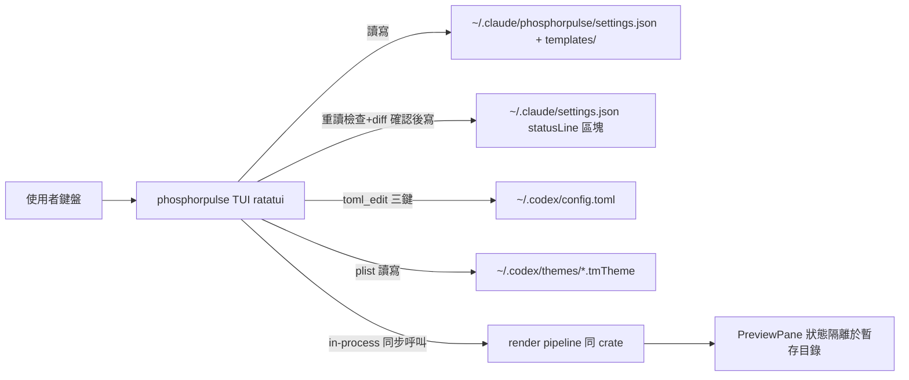

# tui — phosphorpulse TUI（ratatui 全畫面對等＋version＋Codex Settings＋tmTheme Editor）

以 ratatui 重寫凍結 phosphorflux 1.2.0 的 TUI（行為基準＝
`phosphorflux/src/tui/**`＋`src/install/settingsWriter.ts`，逐畫面對照；
**bug-for-bug parity 原則沿 renderer-parity**：TS 的怪癖照抄並標註，除
非明列為強化偏差）。三新增：選單 version、Codex Settings（單行模擬
preview）、tmTheme 色彩編輯器。UI 權威：本目錄 `design-ux.md`（panel 修
正後版本，雙檔指紋 gate 一併鎖定）。

**與 renderer-parity 偏差 1 的關係（panel 修正後）**：TS 的 TUI 本就要求
TTY（無 TTY exit 1）。本變更定義：無參數＋**stdin 為 TTY**→啟動 TUI；
無參數＋**非 TTY**→維持現行「印說明＋exit 1」。renderer-parity 偏差 1
自然收窄為非 TTY 案例，其既有測試
`tests/stdin_edge.rs::test_req01_no_args_exit1`（以關閉的 stdin 執行＝非
TTY）**繼續有效、不改寫**——無規格衝突、無覆蓋倒退。

新依賴（獲准）：`ratatui`＋`crossterm`、`toml_edit`、`plist`。
**並行寫入姿態（繼承聲明）**：own config 為 last-writer-wins（沿
renderer-parity／TS pomodoroStateFile 的刻意決定，無鎖）；多寫者外部檔
（settings.json、config.toml、tmTheme）以「寫前重讀 stale 檢查」防確認
後覆蓋，仍非鎖——中止重 diff 是唯一手段，殘餘視窗接受並明載。

## System context

## Requirements

### REQ-01 啟動路由、TTY 與共通防護
無參數＋TTY：own config 不存在，**或** `~/.claude/settings.json` 的
`statusLine.command` 不含 `phosphorpulse`（含檔案／區塊／command 缺席）→Wizard；
合法 own config 且已接線→MainMenu；壞 own config→ErrorScreen（路徑＋位置＋原因）。
**2026-08-15 使用者決策，偏離 TS（原觸發僅 own config 缺席）**。無參數＋非 TTY：印說明＋exit 1（沿 renderer-parity
偏差 1，測試已存在）。終端 <80×24→單行提示不崩潰；resize 中編輯狀態保
留重繪；文字欄位邊界依 design-ux MASTER（上限 256、grapheme backspace
＝強化偏差）。（R1、R14）

### REQ-02 Wizard 五步（六態狀態機）
language→nerdFont→（bin 缺失時 BinInstall 迴圈，含 binStillMissing 死
路）→template（PreviewPane 跟隨）→settings diff 確認。確認 y 的寫入順
序**沿 TS：settings.json 區塊先、own config 後**。狀態機轉移與 TS 六態
相同。（R2）

### REQ-03 MainMenu 對等畫面
七畫面＋語言列（六對等＋Codex Settings）：RowsSegments（rows≤3、
layout、pomodoro ←/→）、SubagentLine、ColorsTheme（colorDepth/fg/
gauge/pathDepth/nerdFont；bg 不開放）、Templates（內建＋saved＋import/
export）、SettingsInstall（bin 偵測改指 phosphorpulse；`w` 共用確認畫
面）、SaveExit（(a) own config 原子寫，失敗顯示 error；(b) settings.json
經 DEFAULT_COMMANDS 重 upsert 區塊＋refreshInterval 恆設 1
（2026-08-15 使用者決策，偏離 TS 的 pomodoro 條件邏輯——Rust 版 render
~4ms，常駐 refresh 無成本），**失敗吞掉僅 log**——皆沿 TS 實際行為含其怪癖）。畫面
編輯邏輯以純 draft-ops 函式實作（可測）。（R3、R6、R7、R8）

### REQ-04 PreviewPane
底部常駐；in-process **同步**渲染（無 debounce/取消——強化偏差：Rust
渲染 ~3ms 不需 TS 的 80ms debounce）；固定樣本 stdin＋mock lookups（不
fork）；**狀態隔離**：pomodoro/cache 路徑指向 per-process 暫存目錄，絕
不觸真實 config 目錄（沿 TS mkdtemp 隔離）；含 subagent 樣本列。（R4）

### REQ-05 i18n
en/zh-TW 全字串成對（涵蓋 TS i18n.ts 現行全部鍵——實數以凍結檔為準，
不硬編數字——＋新畫面鍵）；鍵以 Rust 型別（enum 或等價）表達使 use-site
漂移為編譯錯誤（對等 TS `keyof` 閘）；`t(lang, key, params)` 佔位插值；
語言列即時切換。（R5）

### REQ-06 version 顯示
MainMenu 與 Wizard 標題列左上 `phosphorpulse v{CARGO_PKG_VERSION}`
（dim、不可聚焦；視覺屬 S-11 走查）。（R9）

### REQ-07 Codex Settings
讀寫 `~/.codex/config.toml` 僅三鍵。`tui.status_line`：已知 id 固定目錄
（恰八項，見 design-ux；非開放清單）供新增；未知 id 顯示 dim
「(unknown)」、可隨排序移動、不可刪除改名。`tui.status_line_use_colors`
toggle（引導開啟——R13 降級裁決）。`tui.theme`：掃 `~/.codex/themes/
*.tmTheme` 檔名 stem＋內建名單。寫入：toml_edit 就地編輯（非目標行 byte
原樣）＋**經 write_atomic 落盤**＋寫前重讀 stale 檢查（外部改動→中止、
重 diff）＋寫前 diff 確認。單行模擬 preview 依 design-ux（固定 dim 誠實
聲明）。config.toml 不存在→empty 引導；解析失敗→唯讀。（R10、R11、R13）

### REQ-08 tmTheme Editor
入口僅 Codex Settings theme 項。僅 XML plist（binary→唯讀 error）。僅
編輯色彩：全域 foreground/background＋各 scope 條目 foreground（無
fontStyle/caret）。scope 解析＝selector 逗號拆分後最長前綴匹配；四個
Codex 狀態 scope 置頂顯示解析結果；多個狀態 scope 落在同一融合條目時提
供 guided **split**（僅允許為此四 scope 建專屬條目、初值複製原色）——
除此不增刪條目。寫回：plist 語意 round-trip（未編輯鍵值 re-parse 相等，
不保證 byte 排版）＋write_atomic＋寫前重讀 stale 檢查＋diff 確認。目錄
無檔→引導另存內建主題副本。（R12）

### REQ-09 寫入品質地板
所有外部檔寫入一律經既有 `atomic_write::write_atomic`（重用，無新機
制）；主要寫失敗→畫面內 error 單行、狀態保留、不崩潰；SaveExit 次要寫
失敗→吞掉僅 log（TS 刻意行為）。錯誤案例僅限五個 writer 場景（S-01/
S-02/S-03/S-05/S-07），非 writer 場景不強加。（R14 寫入面）

## Scenarios

### S-01 own config 存讀 round-trip 與渲染相容
- GIVEN 暫存 HOME；TUI draft（全欄位）
- WHEN 以 SaveExit 寫入函式存檔，再以 renderer config loader 載入並渲染
  固定樣本 stdin
- THEN 載入無 fail-loud、渲染非空；round-trip 欄位相等；寫入目錄不可寫
  案例→回錯誤、無殘留 tmp 檔
- Test mapping: `tests/tui_config_roundtrip.rs::test_s01_draft_roundtrip_renderable`
- Verification command: `~/.cargo/bin/cargo test --test tui_config_roundtrip test_s01`

### S-02 settings.json 區塊寫入（TS 忠實語意）
- GIVEN 暫存 HOME 四案例：settings.json **不存在**／存在但缺區塊／存在
  且區塊為舊值／存在且已正確
- WHEN 執行與 Wizard/SettingsInstall 共用的寫入路徑
- THEN 不存在案例：建檔寫入兩區塊、**無備份**（TS writeStatuslineBlocks
  分支）；存在三案例：一律重讀→diff→寫（**含已正確案例也重寫＋產
  `.bak-` 備份**——TS 無 no-op 防護，忠實對等）；無關鍵**語意保留**
  （re-parse 相等；排版正規化為 JSON.stringify(,2) 等價行為，不保證
  byte）；寫入經 write_atomic
- Test mapping: `tests/tui_settings_writer.rs::test_s02_statusline_blocks_write`
- Verification command: `~/.cargo/bin/cargo test --test tui_settings_writer test_s02`

### S-03 SaveExit 的 settings.json 改寫語意（TS 忠實）
- GIVEN settings.json 含自訂 statusLine.command 與 refreshInterval；
  draft 三案例：pomodoro 新增／refreshSec 變更／無 pomodoro
- WHEN 執行 SaveExit 的 maybeRewrite 路徑
- THEN 前兩案例：兩區塊經 DEFAULT_COMMANDS 重 upsert（**自訂 command 被
  覆蓋＝TS 已知怪癖，斷言此行為並註記**）、refreshInterval 恆設 1；第三案
  例：refreshInterval 同樣恆為 1（**2026-08-15 使用者決策，偏離 TS 的
  pomodoro 條件移除**）；無關鍵語意保留；未觸發
  條件（pomodoro 存在性與 refreshSec 皆未變）→檔案完全不動（bytes 相同）
- Test mapping: `tests/tui_settings_writer.rs::test_s03_saveexit_rewrite_semantics`
- Verification command: `~/.cargo/bin/cargo test --test tui_settings_writer test_s03`

### S-04 Templates memento round-trip
- GIVEN 暫存 templates 目錄；一份 draft
- WHEN 另存→載入→匯出→匯入；再匯入壞 JSON
- THEN 前四步 round-trip 相等；壞檔→錯誤且 draft 不變
- Test mapping: `tests/tui_templates.rs::test_s04_memento_roundtrip`
- Verification command: `~/.cargo/bin/cargo test --test tui_templates test_s04`

### S-05 config.toml 三鍵就地編輯
- GIVEN fixture config.toml：含註解、無關鍵、**未知 status_line id**、多
  行陣列格式
- WHEN 依序：重排（含未知 id 移動）、toggle use_colors、換 theme，各自
  經確認寫回；另兩案例：寫回前檔案被外部修改（stale）；目標目錄不可寫
- THEN 目標鍵正確；未知 id 存活且位置隨排序；**非目標行 byte 不變**；
  stale 案例→中止回錯誤、檔案不動；不可寫案例→錯誤、原檔完好無半寫；
  解析失敗 fixture→唯讀（寫入函式拒絕）
- Test mapping: `tests/tui_codex.rs::test_s05_toml_inplace_edit`
- Verification command: `~/.cargo/bin/cargo test --test tui_codex test_s05`

### S-06 Codex 單行 preview 渲染函式
- GIVEN 使用者風格 tmTheme fixture（**融合條目**：constant.numeric 與
  constant.language 同條目同色——真實 Matrix-Tron 形狀）；item 排序含
  context-used/weekly-limit；use_colors 兩態
- WHEN 呼叫 preview 函式：融合態一次；執行 split（Usage/Limit 分家改色）
  後再一次
- THEN 融合態：兩者同色（如實反映）；split 後：context-used 帶 Usage 新
  色、weekly-limit 帶 Limit 新色（自 tmTheme 前綴匹配解析）；
  use_colors=false 全 dim；輸出含 ESC
- Test mapping: `tests/tui_codex.rs::test_s06_preview_line_render`
- Verification command: `~/.cargo/bin/cargo test --test tui_codex test_s06`

### S-07 tmTheme 讀寫 round-trip 與 split
- GIVEN 真實形狀 tmTheme fixture（融合條目＋storage.type 缺席）；另一份
  binary plist；另一份壞 XML
- WHEN 解析→改全域 foreground→寫回→重讀；執行 guided split（為四個
  Codex scope 建專屬條目）→寫回→重讀；binary 與壞 XML 各解析一次；
  目標目錄不可寫時寫回一次
- THEN 編輯生效、未編輯鍵值 re-parse 相等；split 後新條目存在、原條目保
  留、Codex 四 scope 解析各得其色；寫回為合法 XML plist；binary/壞 XML
  →錯誤唯讀、無寫入；不可寫→錯誤、原檔完好
- Test mapping: `tests/tui_tmtheme.rs::test_s07_tmtheme_roundtrip_split`
- Verification command: `~/.cargo/bin/cargo test --test tui_tmtheme test_s07`

### S-08 i18n 完整性與編譯期鍵閘
- GIVEN i18n 表（鍵為 Rust 型別）
- WHEN 遍歷全部鍵；對照凍結 TS i18n.ts 的鍵集合（以 build script 或測試
  讀 TS 檔萃取鍵名——對等鍵須存在，新畫面鍵允許超集）
- THEN 每鍵 en/zh-TW 皆非空；插值正確；TS 對等鍵無缺漏（實數以檔案為
  準）；use-site 用不存在的鍵＝編譯錯誤（型別閘，測試註記驗證方式）
- Test mapping: `tests/tui_i18n.rs::test_s08_i18n_completeness`
- Verification command: `~/.cargo/bin/cargo test --test tui_i18n test_s08`

### S-09 Wizard 狀態機（純邏輯，六態）
- GIVEN 狀態機（無終端 IO）
- WHEN 走：正常五步；bin 缺失→BinInstall→重偵測成功回歸；binStillMissing
  死路；confirm 按 n 回 template；confirm 按 y
- THEN 除 BinStillMissing 僅 `RedetectBin{bin_found:true}` 可回 template 的
  單一 escape 外（其餘輸入含 `bin_found:false` 仍為死路；**2026-08-16 使用者決策**），
  轉移與 TS 六態相同；y 後的寫入順序斷言為 **settings.json 先、own config 後**
  （順序作為狀態機輸出的動作序列可測）
- Test mapping: `tests/tui_wizard_fsm.rs::test_s09_wizard_transitions`
- Verification command: `~/.cargo/bin/cargo test --test tui_wizard_fsm test_s09`

### S-10 標題列 version
- GIVEN 標題列組字函式
- WHEN 組 MainMenu 與 Wizard 標題
- THEN 皆匹配正則 `phosphorpulse v[0-9]+\.[0-9]+\.[0-9]+`（非與 env! 自
  比對的套套邏輯）
- Test mapping: `tests/tui_i18n.rs::test_s10_title_version`
- Verification command: `~/.cargo/bin/cargo test --test tui_i18n test_s10`

### S-15 無參數非 TTY 行為（既有契約延續）
- GIVEN 關閉的 stdin（非 TTY）、合法 config
- WHEN 無參數執行 binary
- THEN exit 1、stdout 含說明（既有
  `tests/stdin_edge.rs::test_req01_no_args_exit1` 持續把關；本場景為契約
  聲明，不新增測試檔——TTY 分支由 S-14 manual 覆蓋）
- Test mapping: `tests/stdin_edge.rs::test_req01_no_args_exit1`（既有）
- Verification command: `~/.cargo/bin/cargo test --test stdin_edge test_req01`

### S-16 畫面編輯邏輯（純 draft-ops）
- GIVEN draft 與 draft-ops 函式（無終端 IO）
- WHEN rows：add/insert/delete/move/layout toggle/第 4 列新增；pomodoro
  ←/→ 到上下界；ColorsTheme：colorDepth 循環、fg named 循環、gauge 調
  值到界、pathDepth 界；SubagentLine 同組操作
- THEN 各操作結果與 TS 對應畫面語意一致（rows≤3 擋第 4 列；界值 clamp；
  循環回繞）；違規操作不改 draft
- Test mapping: `tests/tui_draft_ops.rs::test_s16_draft_ops_semantics`
- Verification command: `~/.cargo/bin/cargo test --test tui_draft_ops test_s16`

### S-17 PreviewPane 隔離與內容
- GIVEN preview 渲染函式＋暫存隔離目錄；真實 config 目錄置監測 fixture
- WHEN 連續渲染多次（含 pomodoro 段 draft）
- THEN 輸出含全主列段與 subagent 樣本列、含 ESC；**真實 config 目錄零寫
  入**（pomodoro/cache 檔 mtime/bytes 不變）；無子行程 fork（PATH 插樁
  計數 0）；單次渲染 <50ms（同步可行性佐證，report-only 印實數）
- Test mapping: `tests/tui_preview.rs::test_s17_preview_isolation`
- Verification command: `~/.cargo/bin/cargo test --test tui_preview test_s17`

### S-11 [MANUAL] TUI 對等走查
- GIVEN 本機並行凍結 TS TUI 與新 TUI
- WHEN 並排走七畫面＋語言列＋Wizard
- THEN 佈局、鍵位、行為、preview 即時性一致，**允許偏差為下列列舉**：
  (1) 標題列 version（新增）、(2) MainMenu 多一項 Codex Settings、(3)
  終端過小防護（強化）、(4) preview 無 debounce 延遲（強化）、(5)
  grapheme backspace（強化）、(6) SettingsInstall bin 偵測對象——其餘
  差異一律視為缺陷
- 理由：互動視覺對照，無法自動化。
- Test mapping: none（manual scenario）
- Verification command: manual — 並排互動走查

### S-12 [MANUAL] Codex Settings 實機
- GIVEN 真實 `~/.codex/config.toml`（先備份）
- WHEN TUI 重排 status_line、確認 use_colors、換 theme，寫入後啟動 codex
- THEN codex 狀態列反映變更；config.toml 其他內容未變；preview 行可對照
  （聲明過的出入允許）
- 理由：需真實 Codex CLI 互動確認。
- Test mapping: none（manual scenario）
- Verification command: manual — 實機操作＋codex 目視

### S-13 [MANUAL] tmTheme Editor 實機（含 split）
- GIVEN 真實 `~/.codex/themes/Matrix-Tron.tmTheme`（先備份；已知其
  Usage/Limit 融合單條目）
- WHEN TUI 執行 split 並分別調 Usage/Limit 色，寫回，重啟 codex
- THEN codex 狀態列 context % 與 5h/weekly % 呈現**不同**新色；theme 其
  他部分語意不變
- 理由：Codex 本體渲染的最終視覺確認。
- Test mapping: none（manual scenario）
- Verification command: manual — 實機操作＋codex 目視

### S-14 [MANUAL] Wizard 首跑／重新接線（TTY）
- GIVEN 移走 own config（備份），**或**保留合法 own config 但令
  `~/.claude/settings.json` 的 `statusLine.command` 不含 `phosphorpulse`；真實終端（TTY）
- WHEN 無參數啟動走完 Wizard
- THEN 兩案例皆進 Wizard（TTY 分支的實機確認）；首跑案例重建 config，重新接線
  案例載入並保留既有 own config、Esc 回 MainMenu；確認後 settings.json 區塊正確、進
  MainMenu；statusline 下一 tick 正常。**2026-08-15 使用者決策，偏離 TS（原觸發僅 own config 缺席）**
- 理由：TTY 啟動與端到端首用體驗，互動確認。
- Test mapping: none（manual scenario）
- Verification command: manual — 實機走查

## Requirements Checklist（非 gate 附錄；R↔REQ 對照）

- [ ] R1→REQ-01（S-15＋S-14）；R14→REQ-01/REQ-09（error 案例限五 writer
      場景 S-01/S-02/S-03/S-05/S-07）
- [ ] R2→REQ-02（S-09、S-14）
- [ ] R3→REQ-03（S-16 自動化＋S-11 走查）；R6→REQ-03（S-03）；
      R7→REQ-03（S-02）；R8→REQ-03（S-04）
- [ ] R4→REQ-04（S-17 自動化＋S-11 即時性走查）
- [ ] R5→REQ-05（S-08）
- [ ] R9→REQ-06（S-10＋S-11 視覺）
- [ ] R10→REQ-07（S-05、S-12）；R11→REQ-07（S-06）；R13→REQ-07（S-12）
- [ ] R12→REQ-08（S-06、S-07、S-13）
- [ ] 與 renderer-parity 偏差 1 的收窄關係已明載（無測試改寫、無覆蓋倒退）

## Rejected options

- 讓 phosphorpulse 被 Codex 當外掛 statusline 呼叫：Codex 無外部命令
  hook（issue #17827 未實作，僅內建 item 清單）→ 棄
- 手寫 TOML 行級編輯：多行陣列/轉義邊緣案例破壞使用者設定檔風險 → 棄
  （改 toml_edit 就地編輯）
- 沿用 TS/Ink TUI 不重寫：與「單一 binary、TS 版凍結」裁決矛盾 → 棄
- 拆兩/三變更（選項 B/C）：使用者裁決單一變更全包 → 棄
- tmTheme 做通用 plist 編輯器：範圍爆炸——編輯器只針對主題色彩鍵值 →
  棄通用版
- 依賴 Codex fork/PR 加 per-item `tui.status_line_colors`（Codex 自產計
  畫路線）：需長期維護 patched binary（每次 release rebase＋自 build）→
  使用者裁決棄，降級接受靜態 theme 色
- 發上游 PR 等合併：時程不可控 → 棄（未來想要可另開）
- 門檻變色（context %/weekly % 依值變色）：查證為 Codex 本體寫死不可設
  定 → 降級為 tmTheme 靜態 scope 色（使用者裁決）
- 改寫 renderer-parity 的 no-args 測試以讓 TUI 接管所有無參數路徑：TS
  本就 TTY-only，以 TTY 分流即無衝突 → 棄改寫（panel 修正）
- PreviewPane 移植 TS 的 80ms debounce＋取消機制：Rust 同步渲染 ~3ms 無
  此需求，徒增併發複雜度 → 棄（panel 簡化）

## Adjudications

三鏡片全 panel（elf-archer／orc-saboteur／hobbit-gardener，2026-08-15，
opus）對 v1 的合議與 Maia 裁決（v2 已全數落實）：

- REQ-01: REFUTED →（elf）零場景＋非 TTY 行為未定義且與既有測試衝突 →
  TTY 分流設計：非 TTY 沿舊行為（既有測試續用），TTY 進 TUI（S-14）；
  supersession 改為「收窄」，不改寫任何已結案測試。
- REQ-02: REFUTED →（elf）雙寫順序與 TS 相反（settings 先、own config
  後）＋六態漏 binStillMissing → 修正順序並入 S-09 斷言。
- REQ-03: REFUTED →（elf/orc）最大行為面僅 manual 覆蓋、S-11 自我矛盾
  （允許偏差數與實際不符）→ 新增 S-16 純 draft-ops 測試；S-11 偏差改為
  六項列舉。
- REQ-04: REFUTED →（gardener）debounce/取消在 Rust 無必要 → 刪，同步
  渲染；（orc）掉了 TS 的 temp-dir 狀態隔離 → 補回（S-17 斷言零真實目
  錄寫入）。
- REQ-05: REFUTED →（elf/gardener）「75 鍵」實為 98 且不可斷言 → 刪數
  字，以凍結檔萃取鍵集合對照＋Rust 型別鍵閘（S-08）。
- REQ-06: SURVIVED（弱）→（elf）S-10 套套邏輯 → 改正則斷言。
- REQ-07: REFUTED →（elf）id 目錄開放式省略號不可判定＋未知 id 位置語
  意缺失＋atomic 遺漏；（orc）並行寫入 stale 洞 → 固定八項目錄、未知
  id 顯示/移動/不可刪語意、write_atomic、寫前重讀 stale 檢查（S-05）。
- REQ-08: REFUTED（最重）→（elf）真實 Matrix-Tron 把 Usage/Limit 融合
  單條目、storage.type 缺席——唯讀清單下雙色不可達 → 新增 guided
  split（僅四 Codex scope）＋前綴匹配規則（S-06/S-07/S-13 全面改寫）；
  design-ux「byte 原樣」措辭同步修正為語意 round-trip。
- REQ-09: REFUTED →（elf/orc/gardener）原子性無場景證明＋與 TS 的
  SaveExit 吞錯設計矛盾＋錯誤案例被強加到非 writer 場景 → 重用
  write_atomic、錯誤案例限五 writer 場景、SaveExit 次要寫吞錯沿 TS。
- S-02/S-03: REFUTED →（elf）冪等 no-op／byte 原樣／共用函式三點皆與
  settingsWriter.ts 原始碼矛盾；absent-file 分支無備份未覆蓋 → 全面改
  為 TS 忠實語意（v2 文字即裁決）。
- 測試檔整併（gardener）：10→9 檔（S-10 併入 tui_i18n；tui_codex 合
  併）；S-15 重用既有 stdin_edge 測試。
- 駁回/未採納：orc 的「settings.json 需 lock/CAS」→ 降為寫前重讀 stale
  檢查（TS 亦無鎖，殘餘視窗明載接受）；orc 的 ENOSPC 注入 → 以不可寫
  目錄案例替代（可攜且覆蓋同一保證）；gardener 的 tmTheme「單一入口」
  「hex-only」「砍 fontStyle」→ 採納入 design-ux。
- 殘餘已知風險（接受並明載）：toml_edit 對多行陣列重排時 decor 的確切
  行為、plist crate 的字典序保持——皆由 S-05/S-07 的斷言在 RED 期實測
  裁定，若 crate 行為不符則觸發 plan-drift 協定調整斷言措辭（語意不變）。
