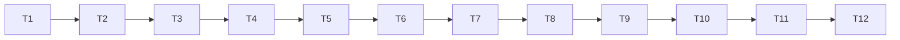

# tasks — tui

順序＝依賴順序；cargo 一律 `~/.cargo/bin/cargo`，cwd＝專案根。builder 派
工走 **codex 直呼路徑**（rules/customize/codex-direct-call.md），prompt
必帶 stdd-codex-dispatch-checklist.md 適用條款。[MODIFY] 引用來自 survey
（design-be §2）。

## Tasks

- [x] T1 `[INFRA]` 依賴與 tui 模組鷹架
  - 理由：無場景 ID 的基礎建設——Cargo.toml [MODIFY Cargo.toml:10-13] 加
    ratatui/crossterm/toml_edit/plist；src/tui/ 模組空殼（design-be §1）
    編譯通過；main.rs no-args 分支 [MODIFY src/main.rs:34-39 no_args] 改
    為 TTY 偵測（IsTerminal）：非 TTY 走現行為、TTY 呼叫 run_tui() 空殼
    （先印 placeholder exit 0 亦可）。
  - 驗證：`~/.cargo/bin/cargo build` 過；`~/.cargo/bin/cargo test` 全綠
    （**含既有 stdin_edge no-args 測試不得轉紅**——S-15 回歸契約）。

- [x] T2 `S-08,S-10` [NEW] i18n 表＋chrome version
  - RED：`tests/tui_i18n.rs::test_s08_i18n_completeness`＋
    `test_s10_title_version` → Verify RED
  - GREEN：src/tui/i18n.rs（Key enum、en/zh-TW 成對、TS 鍵集合萃取對
    照）＋src/tui/chrome.rs（標題含 `phosphorpulse v` 正則）→ Verify
    GREEN → REFACTOR → Spec re-check
  - 驗證：`~/.cargo/bin/cargo test --test tui_i18n`

- [x] T3 `S-16` [NEW] draft-ops 純函式
  - RED：`tests/tui_draft_ops.rs::test_s16_draft_ops_semantics` → Verify RED
  - GREEN：src/tui/draft_ops.rs（rows/segments/colors/pomodoro 全操作，
    語意對照凍結 TS 各畫面）→ Verify GREEN → REFACTOR → Spec re-check
  - 驗證：`~/.cargo/bin/cargo test --test tui_draft_ops`

- [x] T4 `S-09` [NEW] Wizard 六態 FSM
  - RED：`tests/tui_wizard_fsm.rs::test_s09_wizard_transitions`（含
    binStillMissing 死路、confirm n 回退、y 的動作序列順序＝settings 先
    own config 後）→ Verify RED
  - GREEN：src/tui/wizard.rs → Verify GREEN → REFACTOR → Spec re-check
  - 驗證：`~/.cargo/bin/cargo test --test tui_wizard_fsm`

- [x] T5 `S-01` [NEW] own config round-trip
  - RED：`tests/tui_config_roundtrip.rs::test_s01_draft_roundtrip_renderable`
    （含目錄不可寫 error 案例）→ Verify RED
  - GREEN：SaveExit 寫入函式（重用 config model＋write_atomic
    [src/atomic_write.rs:8]；讀端 config/mod.rs:53 load）→ Verify GREEN
    → REFACTOR → Spec re-check
  - 驗證：`~/.cargo/bin/cargo test --test tui_config_roundtrip`

- [x] T6 `S-02,S-03` [NEW] settings.json 寫入器（TS 忠實）
  - RED：`tests/tui_settings_writer.rs::test_s02_statusline_blocks_write`
    （四案例含 absent-file 無備份分支）＋
    `test_s03_saveexit_rewrite_semantics`（含 DEFAULT_COMMANDS 怪癖與
    refreshInterval 移除）→ Verify RED
  - GREEN：src/tui/settings_writer.rs（語意照凍結 settingsWriter.ts）→
    Verify GREEN → REFACTOR → Spec re-check
  - 驗證：`~/.cargo/bin/cargo test --test tui_settings_writer`

- [x] T7 `S-04` [NEW] templates memento
  - RED：`tests/tui_templates.rs::test_s04_memento_roundtrip` → Verify RED
  - GREEN：src/tui/templates_io.rs → Verify GREEN → REFACTOR → Spec re-check
  - 驗證：`~/.cargo/bin/cargo test --test tui_templates`

- [x] T8 `S-17` [NEW] PreviewPane 隔離
  - RED：`tests/tui_preview.rs::test_s17_preview_isolation`（真實目錄零寫
    入、零 fork、含 subagent 樣本列、<50ms report）→ Verify RED
  - GREEN：src/tui/preview.rs（同步呼叫 render_value
    [src/render/mod.rs:125]，暫存目錄隔離；必要時 [MODIFY render/mod.rs]
    增加參數化入口，不改既有公開行為）→ Verify GREEN → REFACTOR →
    Spec re-check
  - 驗證：`~/.cargo/bin/cargo test --test tui_preview`

- [x] T9 `S-05,S-06` [NEW] Codex config 三鍵＋單行 preview
  - RED：`tests/tui_codex.rs::test_s05_toml_inplace_edit`（含 stale 中
    止、不可寫、未知 id 位置語意）＋`test_s06_preview_line_render`（融合
    fixture＋split 後雙色＋use_colors off）→ Verify RED
  - GREEN：src/tui/codex/config_io.rs（toml_edit＋write_atomic＋bytes
    快照 stale 檢查）＋codex/preview.rs（重用 render/mod.rs:34 color）→
    Verify GREEN → REFACTOR → Spec re-check
  - 驗證：`~/.cargo/bin/cargo test --test tui_codex`

- [x] T10 `S-07` [NEW] tmTheme 讀寫與 split
  - RED：`tests/tui_tmtheme.rs::test_s07_tmtheme_roundtrip_split`（融合
    fixture、binary plist 拒收、壞 XML、不可寫、split 後四 scope 各得其
    色）→ Verify RED
  - GREEN：src/tui/codex/tmtheme.rs（plist crate、前綴匹配、split、
    write_atomic＋stale）→ Verify GREEN → REFACTOR → Spec re-check
  - 驗證：`~/.cargo/bin/cargo test --test tui_tmtheme`

- [x] T11 `[INFRA]` ratatui 畫面組裝與事件迴圈
  - 理由：純繪製/鍵位轉發薄層（Screen trait、8 畫面、KeyHint、
    ErrorScreen、router、terminal setup/teardown），互動行為由 S-11/
    S-14 manual 驗收；可測邏輯已全數在 T2-T10 覆蓋，本層單元測試僅組裝
    煙霧（screens 可建構、router 三態分派正確）。
  - 驗證：`~/.cargo/bin/cargo test`（全綠）＋`~/.cargo/bin/cargo build
    --release` 過。

- [x] T12 `S-15` [MODIFY src/main.rs:34-39 no_args] 非 TTY 契約回歸確認
  - 無新 RED（既有 `tests/stdin_edge.rs::test_req01_no_args_exit1` 已存
    在且必須全程綠——本任務為回歸契約閉環：T1/T11 改完 no-args 分支後
    正式重跑並引述輸出；TTY 分支行為由 S-14 manual 收）。保留一單獨任務
    的理由：S-15 是 spec 場景，需在 tasks.md 有獨立可勾的歸屬。
  - 驗證：`~/.cargo/bin/cargo test --test stdin_edge`

## 任務依賴

（T2-T10 邏輯上可部分並行，但單一 builder 序列執行避免同檔衝突；T11 組
裝依賴 T2-T10 全部產物；T12 在分支改動全落定後收尾。）

## Manual verification checklist（stdd-execute 完成 gate 逐項確認）

- [ ] S-11 TUI 對等走查（理由：互動視覺對照無法自動化；允許偏差＝spec
      列舉六項）
- [ ] S-12 Codex Settings 實機（理由：需真實 Codex CLI 確認；先備份
      config.toml）
- [ ] S-13 tmTheme Editor 實機含 split（理由：Codex 本體渲染最終視覺確
      認；先備份 tmTheme）
- [ ] S-14 Wizard 首跑（TTY）（理由：TTY 啟動與端到端首用體驗；先備份
      own config）

## D5 遞延

無（0/17，0%）。

## Requirements Checklist（S-51，見 design-be.md 附錄——同一份，不重複）
